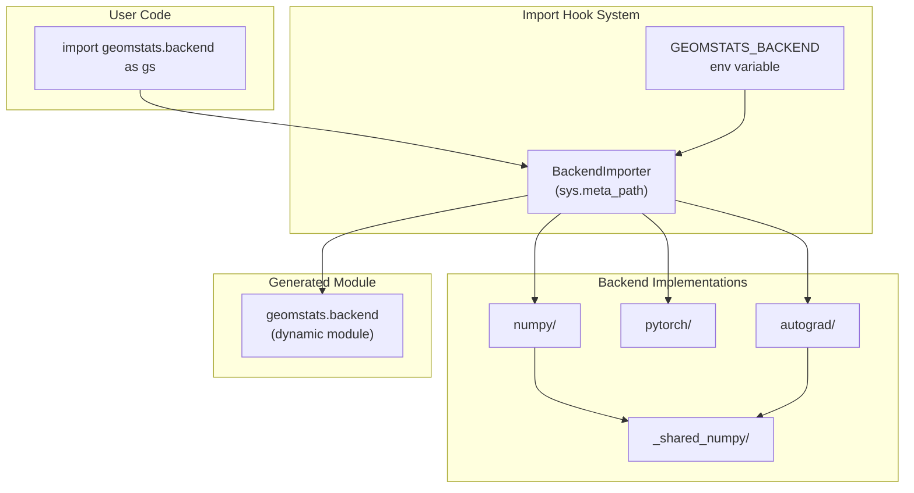

# Critical Assessment of the Geomstats Backend

## Current Architecture Overview

The geomstats backend in [`geomstats/_backend/`](geomstats/_backend/__init__.py) implements a **module-level abstraction layer** that allows the library to work with NumPy, PyTorch, or Autograd. The architecture consists of:



**Key Components:**

- [`__init__.py`](geomstats/_backend/__init__.py): Custom import hook (`BackendImporter`) + attribute registry (`BACKEND_ATTRIBUTES`)
- [`_dtype_utils.py`](geomstats/_backend/_dtype_utils.py): Complex machinery for global dtype management
- [`_shared_numpy/`](geomstats/_backend/_shared_numpy/): Shared code between numpy and autograd backends
- Three backend folders: `numpy/`, `pytorch/`, `autograd/` (~800 lines each)

---

## Main Design Reasons

1. **Framework Agnosticism**: Allow geomstats algorithms to work identically across NumPy (research), PyTorch (deep learning), and Autograd (autodiff without PyTorch overhead)

2. **API Consistency**: Force all backends to expose identical interfaces via `BACKEND_ATTRIBUTES` validation

3. **Transparent Autodiff**: Hide the complexity of automatic differentiation behind a unified `gs.autodiff` API

4. **Global Dtype Control**: Manage float32/float64 precision globally across all operations

5. **Historical Context**: Built before Python Array API standard existed (PEP 681), when each framework had wildly different APIs

---

## Advantages

| Advantage | Description |

|-----------|-------------|

| **Unified API** | Users write `gs.array()`, `gs.einsum()` without caring about backend |

| **Import-time Validation** | Missing attributes cause immediate errors, not runtime surprises |

| **Autodiff Abstraction** | `gs.autodiff.jacobian` works the same for PyTorch and Autograd |

| **Code Sharing** | `_shared_numpy` reduces duplication between numpy/autograd |

| **Tolerance Management** | Backend-specific `atol`/`rtol` values in [`_backend_config.py`](geomstats/_backend/_backend_config.py) |

---

## Critical Drawbacks

### 1. Massive Code Duplication (~150 functions x 3 backends)

```python
# In pytorch/__init__.py (lines 317-324)
def sum(x, axis=None, keepdims=None, dtype=None):
    if axis is None:
        if keepdims is None:
            return _torch.sum(x, dtype=dtype)
        return _torch.sum(x, keepdim=keepdims, dtype=dtype)
    ...

# In numpy/__init__.py - imports numpy.sum directly
from numpy import sum

# In autograd/__init__.py - imports autograd.numpy.sum
from autograd.numpy import sum
```

Each backend must re-implement or re-import every function, even when behavior is identical.

### 2. Complex Dtype Machinery (421 lines of decorators)

[`_dtype_utils.py`](geomstats/_backend/_dtype_utils.py) contains 8+ decorators:

- `_modify_func_default_dtype`
- `_dyn_update_dtype`
- `_pre_cast_out_from_dtype`
- `_pre_cast_fout_to_input_dtype`
- `_pre_cast_out_to_input_dtype`
- `_pre_allow_complex_dtype`
- `_np_box_unary_scalar`
- `_np_box_binary_scalar`

This complexity exists because the architecture fights against each framework's native dtype handling.

### 3. Import-Time Backend Locking

```python
# geomstats/_backend/__init__.py line 19
BACKEND_NAME = get_backend_name()  # Read once, never changes
```

Cannot switch backends at runtime. Users must set environment variable BEFORE first import.

### 4. Scipy Fallbacks Create Inconsistent Behavior

From [`pytorch/linalg.py`](geomstats/_backend/pytorch/linalg.py):

```python
def sqrtm(x):
    np_sqrtm = _np.vectorize(_scipy.linalg.sqrtm, ...)(x)
    return _torch.from_numpy(np_sqrtm)  # Breaks CUDA, breaks autograd
```

PyTorch backend silently falls back to scipy for `sqrtm`, `solve_sylvester`, `fractional_matrix_power` - breaking GPU support and gradient computation.

### 5. No JAX or MLX Support

Despite being popular modern ML frameworks with strong autodiff support, neither JAX nor MLX is implemented.

### 6. Performance Overhead

Multiple layers of wrappers add function call overhead:

```python
# pytorch/__init__.py line 83-101
abs = _box_unary_scalar(target=_torch.abs)
cos = _box_unary_scalar(target=_torch.cos)
# ... every math function wrapped
```

### 7. Maintenance Burden

Adding one new function requires:

1. Add to `BACKEND_ATTRIBUTES` dict
2. Implement in `numpy/__init__.py`
3. Implement in `pytorch/__init__.py`
4. Implement in `autograd/__init__.py`
5. Optionally add to `_shared_numpy/`
6. Add dtype handling if needed

---

## Comparison with einops

| Aspect | geomstats backend | einops |

|--------|------------------|--------|

| **Backend Detection** | Environment variable at import | Runtime from input array type |

| **Code Duplication** | ~150 functions x 3 backends | Single implementation per operation |

| **Framework Support** | 3 (numpy, pytorch, autograd) | 10+ (numpy, pytorch, tf, jax, mlx, tinygrad...) |

| **Adding Backends** | Implement all 150+ functions | Implement ~10 primitive operations |

| **API Style** | Wraps framework APIs 1:1 | Domain-specific notation ("b c h w -> b h w c") |

| **Dtype Handling** | Complex decorator machinery | Relies on framework defaults |

| **Autodiff** | Custom wrappers per backend | Uses framework's native autodiff |

| **Array API Standard** | No | Yes (0.7.0+) |

### Key einops Design Principles geomstats Could Adopt:

1. **Runtime Dispatch**: einops detects backend from input array type:
   ```python
   # einops approach
   def rearrange(tensor, pattern, **axes):
       backend = get_backend(tensor)  # Infers from tensor type
       return backend.rearrange(tensor, pattern, axes)
   ```

2. **Minimal Backend Interface**: Each backend only implements ~10 primitives (reshape, transpose, reduce, etc.), not 150+ functions.

3. **Array API Compatibility**: einops 0.7.0+ supports any framework implementing the Python Array API standard.

---

## Modernization Recommendations

### Option A: Adopt Python Array API Standard (Recommended)

**Complexity: Medium | Impact: High**

Python 3.12+ and NumPy 2.0+ support the Array API standard. Many operations become truly backend-agnostic:

```python
# New approach - works with any Array API compatible library
import array_api_compat

def matmul(x, y):
    xp = array_api_compat.get_namespace(x, y)
    return xp.matmul(x, y)
```

**Benefits:**

- Automatic support for numpy 2.0, PyTorch, JAX, CuPy, MLX
- No more per-backend implementations for standard operations
- Maintained by the Python ecosystem, not geomstats

**Migration Path:**

1. Identify which functions are Array API standard compliant (~80% of `BACKEND_ATTRIBUTES`)
2. Replace those with `array_api_compat` calls
3. Keep backend-specific code only for autodiff and non-standard operations

### Option B: einops-Inspired Minimal Backend Layer

**Complexity: High | Impact: Very High**

Redesign the backend to only require:

- ~10 primitive operations per backend
- Runtime backend detection
- Composition of complex operations from primitives
```python
# Hypothetical new structure
class Backend(Protocol):
    def reshape(self, x, shape): ...
    def transpose(self, x, axes): ...
    def reduce(self, x, op, axes): ...
    def einsum(self, pattern, *arrays): ...
    # ... ~6 more primitives
```


### Option C: Direct einops Integration

**Complexity: Low | Impact: Medium**

Use einops directly for tensor operations, keep only geomstats-specific code:

```python
from einops import rearrange, reduce, repeat

# Replace custom einsum wrappers with einops
def batch_outer(a, b):
    return einsum(a, b, 'b i, b j -> b i j')
```

---

## Recommended Simplification Plan

### Phase 1: Eliminate Duplication with Array API (2-3 weeks effort)

1. Add `array_api_compat` dependency
2. Create [`geomstats/_backend/_array_api.py`](geomstats/_backend/_array_api.py) with runtime dispatch:
   ```python
   import array_api_compat
   
   def get_namespace(*arrays):
       return array_api_compat.array_namespace(*arrays)
   
   def array(data, dtype=None):
       xp = get_namespace(data) if hasattr(data, '__array_namespace__') else numpy
       return xp.asarray(data, dtype=dtype)
   ```

3. Replace ~80% of backend functions with Array API calls

### Phase 2: Simplify Autodiff (1-2 weeks effort)

Keep only backend-specific code for:

- `gs.autodiff.jacobian`
- `gs.autodiff.hessian`
- `gs.autodiff.value_and_grad`

Remove the complex decorator machinery; rely on framework-native dtype handling.

### Phase 3: Runtime Backend Detection (1 week effort)

Replace environment variable with runtime detection:

```python
def get_backend(x):
    if isinstance(x, torch.Tensor):
        return pytorch_backend
    elif hasattr(x, '__jax_array__'):
        return jax_backend
    else:
        return numpy_backend
```

### Phase 4: Add JAX/MLX Support (1 week per backend)

With the simplified architecture, adding new backends becomes:

1. Implement `autodiff.py` (~200 lines)
2. Implement `linalg.py` for non-standard operations (~100 lines)
3. Done

---

## Summary

The geomstats backend was well-designed for its time but now carries significant technical debt. The recommended path forward is:

1. **Short-term**: Integrate `array_api_compat` to eliminate 80% of duplicate code
2. **Medium-term**: Simplify dtype handling by trusting framework defaults
3. **Long-term**: Consider deeper einops integration for tensor manipulation patterns

This would reduce the backend from ~3000 lines across 25 files to ~500 lines across 8 files while adding support for JAX, MLX, CuPy, and any future Array API-compliant framework.