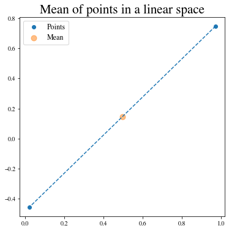
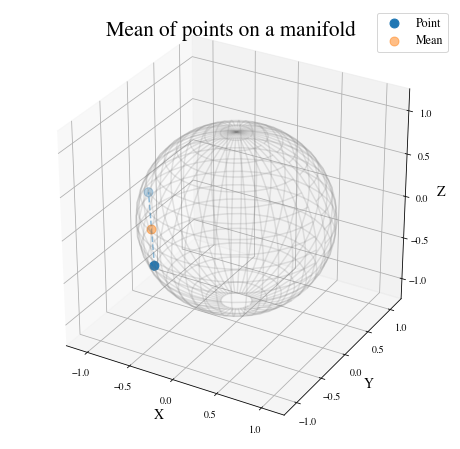
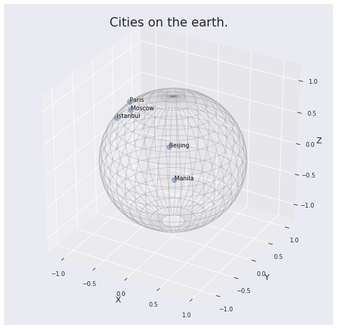
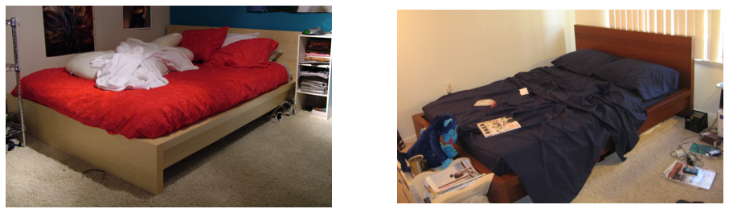
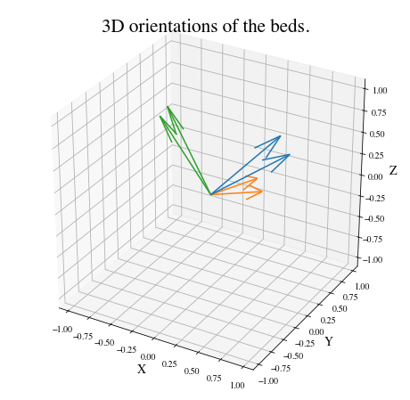

Tutorial: Data on Manifolds
===========================

Setup
-----

Before starting this tutorial, we set the working directory to be the
root of the geomstats repository. In order to have the code working on
your machine, you need to change this path to the path of your geomstats
repository.

.. code:: ipython3

    import os
    import subprocess
    
    geomstats_gitroot_path = subprocess.check_output(
        ['git', 'rev-parse', '--show-toplevel'], 
        universal_newlines=True)
    
    os.chdir(geomstats_gitroot_path[:-1])
    
    print('Working directory: ', os.getcwd())

.. parsed-literal::

    Working directory:  /code/geomstats

We import the backend that will be used for geomstats computations and
set a seed for reproducibility of the results.

.. code:: ipython3

    import geomstats.backend as gs
    
    gs.random.seed(2020)

.. parsed-literal::

    INFO: Using numpy backend

Finally, we import the visualization module.import the visualization
module.

.. code:: ipython3

    import matplotlib
    import matplotlib.image as mpimg
    import matplotlib.pyplot as plt
    
    import geomstats.visualization as visualization
    
    visualization.tutorial_matplotlib()

From data on linear spaces to data on manifolds
-----------------------------------------------

The **science of Statistics** is defined as the collection of data,
their analysis and interpretation. Statistical theory is usually defined
for data belonging to vector spaces, which are *linear spaces*. For
example, we know how to compute the mean of a data set of numbers, like
the mean of students’ weights in a classroom, or of multidimensional
arrays, like the average 3D velocity vector of blood cells in a vessel.

Here is an example of the computation of the mean of two arrays of
dimension 2.

.. code:: ipython3

    from geomstats.geometry.euclidean import Euclidean
    
    dim = 2
    n_samples = 2
    
    euclidean = Euclidean(dim=dim)
    points_in_linear_space = euclidean.random_uniform(n_samples=n_samples)
    print('Points in linear space:\n', points_in_linear_space)
    
    linear_mean = gs.sum(points_in_linear_space, axis=0) / n_samples
    print('Mean of points:\n', linear_mean)

.. parsed-literal::

    Points in linear space:
     [[ 0.97255366  0.74678389]
     [ 0.01949105 -0.45632857]]
    Mean of points:
     [0.49602235 0.14522766]

We plot the points and their mean on the 2D Euclidean space, which is a
linear space: a plane.

.. code:: ipython3

    %matplotlib inline
    
    fig = plt.figure(figsize=(6, 6))
    ax = fig.add_subplot(111)
    
    ax.scatter(points_in_linear_space[:, 0], points_in_linear_space[:, 1], label='Points')
    ax.plot(points_in_linear_space[:, 0], points_in_linear_space[:, 1], linestyle='dashed')
    
    ax.scatter(
        gs.to_numpy(linear_mean[0]), 
        gs.to_numpy(linear_mean[1]), label='Mean', s=80, alpha=0.5)
    
    ax.set_title('Mean of points in a linear space')
    ax.legend();

What happens to the usual statistical theory when the data doesn’t
naturally belong to a linear space. For example, if we want to perform
statistics on the coordinates of world cities, which lie on the earth: a
sphere?

The non-linear spaces we consider are called manifolds. A **manifold
:math:`M` of dimension :math:`m`** is a space that is allowed to be
curved but that looks like an :math:`m`-dimensional vector space in the
neighborhood of every point.

A sphere, like the earth, is a good example of a manifold. We know that
the earth is curved, but at our scale we do not see its curvature. Can
we still use linear statistics when data are defined on these manifolds,
or shall we?

Let’s try.

.. code:: ipython3

    from geomstats.geometry.hypersphere import Hypersphere
    
    sphere = Hypersphere(dim=dim)
    points_in_manifold = sphere.random_uniform(n_samples=n_samples)
    print('Points in manifold:\n', points_in_manifold)
    
    linear_mean = gs.sum(points_in_manifold, axis=0) / n_samples
    print('Mean of points:\n', linear_mean)

.. parsed-literal::

    Points in manifold:
     [[-0.71502435 -0.41197257 -0.56481748]
     [-0.997575   -0.04788171  0.05051201]]
    Mean of points:
     [-0.85629967 -0.22992714 -0.25715273]

We plot the points and their mean computed with the linear formula.

.. code:: ipython3

    %matplotlib inline
    
    fig = plt.figure(figsize=(8, 8))
    ax = fig.add_subplot(111, projection='3d')
    
    visualization.plot(
        points_in_manifold, ax=ax, space='S2', label='Point', s=80)
    
    ax.plot(
        points_in_manifold[:, 0], 
        points_in_manifold[:, 1], 
        points_in_manifold[:, 2], 
        linestyle='dashed', alpha=0.5)
    
    ax.scatter(
        linear_mean[0], linear_mean[1], linear_mean[2], 
        label='Mean', s=80, alpha=0.5)
    
    ax.set_title('Mean of points on a manifold')
    ax.legend();

What happened? The mean of two points on a manifold (the sphere) is not
on the manifold. In our example, the mean city is not on the earth. This
leads to errors in statistical computations.

.. code:: ipython3

    print(sphere.belongs(linear_mean))

.. parsed-literal::

    False

For this reason, researchers aim to build a theory of statistics that is
by construction compatible with any structure we equip the manifold
with. This theory is called *Geometric Statistics*.

**Geometric Statistics** is a theory of statistics on manifolds, that
takes into account their geometric structures. Geometric Statistics is
therefore the child of two major pillars of Mathematics: Geometry and
Statistics.

Examples of data on manifolds
-----------------------------

Why should we bother to build a whole new theory of statistics? Do we
really have data that belong to spaces like the sphere illustrated in
introduction?

Let’s see some examples of data spaces that are naturally manifolds. By
doing so, we will introduce the ``datasets`` and ``visualization``
modules of ``geomstats``.

We first import the ``datasets.utils`` module that allows loading
datasets.

.. code:: ipython3

    import geomstats.datasets.utils as data_utils

World cities: data on the sphere
~~~~~~~~~~~~~~~~~~~~~~~~~~~~~~~~

We load the dataset ``cities``, that contains the coordinates of world
cities in spherical coordinates.

.. code:: ipython3

    data, names = data_utils.load_cities()
    print(names[:5])
    print(data[:5])

.. parsed-literal::

    ['Tokyo', 'New York', 'Mexico City', 'Mumbai', 'São Paulo']
    [[ 0.61993792 -0.52479018  0.58332859]
     [-0.20994315  0.7285533   0.65202298]
     [ 0.14964311  0.93102728  0.33285904]
     [-0.27867026 -0.9034188   0.32584868]
     [-0.62952884  0.6662902  -0.3996884 ]]

We convert the spherical coordinates to X, Y, Z coordinates and verify
that they belong to the sphere.

.. code:: ipython3

    gs.all(sphere.belongs(data))

.. parsed-literal::

    True

Now, we plot the cities on the sphere. We choose only a subset of the
cities that have a nice rendering in the 2D plot of the 3D earth. This
plot is nicer shown in an interactive 3D figure.

.. code:: ipython3

    data, names = data_utils.load_cities()

.. code:: ipython3

    fig = plt.figure(figsize=(10, 10))
    ax = fig.add_subplot(111, projection='3d')
    
    visualization.plot(data[15:20], ax=ax, space='S2', label=names[15:20], s=80, alpha=0.5)
    
    ax.set_title('Cities on the earth.');

Pose of objects in pictures
~~~~~~~~~~~~~~~~~~~~~~~~~~~

We consider the dataset ``poses``, that contains the 3D poses of objects
in images. Specifically, we consider poses of beds in images, i.e. the
3D orientation of each bed within a given 2D image.

The orientation corresponds to a 3D rotation. A 3D rotation :math:`R` is
visually represented as the result of :math:`R` applied to the
coordinate frame :math:`(e_x, e_y, e_z)`.

We first load the dataset.

.. code:: ipython3

    data, img_paths = data_utils.load_poses()
    
    img_path1, img_path2 = img_paths[0], img_paths[1]
    img_path1 = os.path.join(data_utils.DATA_PATH, 'poses', img_path1)
    img_path2 = os.path.join(data_utils.DATA_PATH, 'poses', img_path2)
    
    img1 = mpimg.imread(img_path1)
    img2 = mpimg.imread(img_path2)
    
    fig = plt.figure(figsize=(16, 8))
    
    ax = fig.add_subplot(121)
    imgplot = ax.imshow(img1)
    ax.axis('off')
    ax = fig.add_subplot(122)
    imgplot = ax.imshow(img2)
    ax.axis('off')
    
    plt.show()

We import the manifold of 3D rotations: the Special Orthogonal group in
3D, :math:`SO(3)`. We choose to represent the 3D rotations as rotation
vectors, hence: ``point_type='vector'``.

.. code:: ipython3

    from geomstats.geometry.special_orthogonal import SpecialOrthogonal
    
    so3 = SpecialOrthogonal(n=3, point_type='vector')

We verify that the poses belong to the space of 3D rotations.

.. code:: ipython3

    gs.all(so3.belongs(data))

.. parsed-literal::

    True

We plot the orientations of the first 2 beds.

.. code:: ipython3

    fig = plt.figure(figsize=(8, 8))
    ax = fig.add_subplot(111, projection='3d')
    
    visualization.plot(data[:2], ax=ax, space='SO3_GROUP')
    
    ax.set_title('3D orientations of the beds.');

These orientations are very close, as expected from the corresponding
images.
