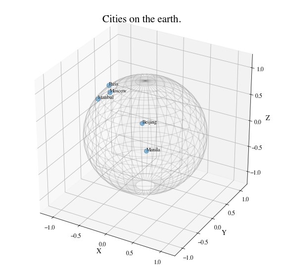
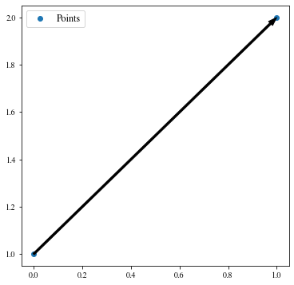
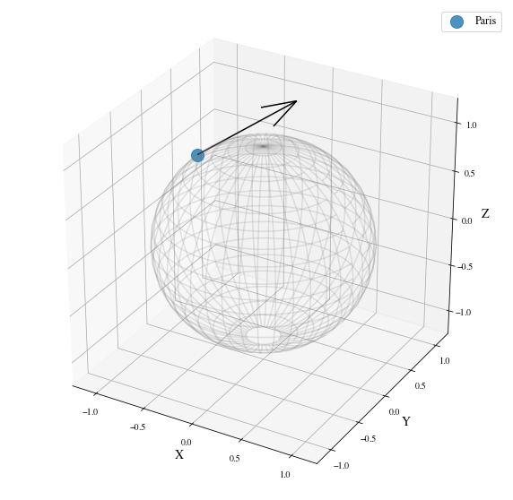
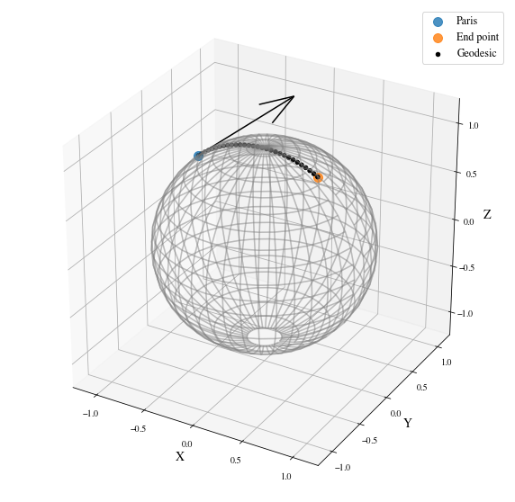
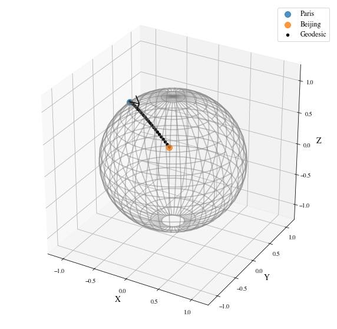
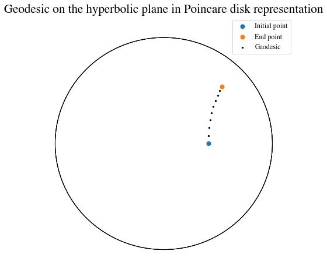
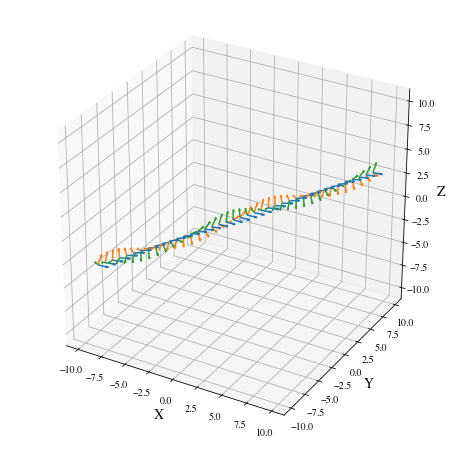

Tutorial: From vector spaces to manifolds
=========================================

Set up
------

Before starting this tutorial, we set the working directory to be the
root of the geomstats repository. In order to have the code working on
your machine, you need to change this path to the path of your geomstats
repository.

.. code:: ipython3

    import os
    import subprocess
    
    geomstats_gitroot_path = subprocess.check_output(
        ['git', 'rev-parse', '--show-toplevel'], 
        universal_newlines=True)
    
    os.chdir(geomstats_gitroot_path[:-1])
    
    print('Working directory: ', os.getcwd())

.. parsed-literal::

    Working directory:  /code/geomstats

We import the backend that will be used for geomstats computations and
set a seed for reproducibility of the results.

.. code:: ipython3

    import geomstats.backend as gs
    
    gs.random.seed(2020)

.. parsed-literal::

    INFO: Using numpy backend

Finally, we import the visualization module.

.. code:: ipython3

    import matplotlib
    import matplotlib.image as mpimg
    import matplotlib.pyplot as plt
    
    import geomstats.visualization as visualization
    
    visualization.tutorial_matplotlib()

From vector spaces to manifolds
-------------------------------

In the previous tutorial, we visualized data that naturally belong to
manifolds, i.e. generalizations of vector spaces that are allowed to
have curvature.

A simple example of such data is the coordinates of cities on the
surface of the earth: they belong to a sphere, which is a manifold.

.. code:: ipython3

    import geomstats.datasets.utils as data_utils
    
    data, names = data_utils.load_cities()
    
    fig = plt.figure(figsize=(10, 10))
    ax = fig.add_subplot(111, projection='3d')
    
    visualization.plot(data[15:20], ax=ax, space='S2', label=names[15:20], s=80, alpha=0.5)
    
    ax.set_title('Cities on the earth.');

The purpose of this tutorial is to show how we can perform elementary
computations on such data.

From addition to exponential map
--------------------------------

The elementary operations on a vector space are: addition, substraction
and multiplication by a scalar. We can add a vector to a point,
substract two points to get a vector, or multiply a vector by a scalar
value.

.. code:: ipython3

    %matplotlib inline
    
    fig = plt.figure(figsize=(6, 6))
    ax = fig.add_subplot(111)
    
    point_a = gs.array([0, 1])
    point_b = gs.array([1, 2])
    vector = point_b - point_a
    
    ax.scatter(point_a, point_b, label='Points')
    ax.arrow(gs.to_numpy(point_a[0]), gs.to_numpy(point_a[1]), 
             dx=gs.to_numpy(vector[0]), dy=gs.to_numpy(vector[1]), 
             width=0.008, length_includes_head=True, color='black')
    
    ax.legend();

For points on a manifold, like the sphere, the same operations are not
permitted. Indeed, adding a vector to a point will not give a point that
belongs to the manifold.

.. code:: ipython3

    fig = plt.figure(figsize=(10, 10))
    ax = fig.add_subplot(111, projection='3d')
    
    paris = data[19]
    vector = gs.array([1, 0, 0.8])
    
    ax = visualization.plot(paris, ax=ax, space='S2', s=200, alpha=0.8, label='Paris')
    
    arrow = visualization.Arrow3D(paris, vector=vector)
    arrow.draw(ax, color='black')
    ax.legend();

The exponential map is the operation that generalizes the addition of a
vector to a point, on manifolds.

The exponential map takes a point and a tangent vector as inputs, and
outputs the point on the manifold that is reached by “shooting” with the
tangent vector. “Shooting” means taking the path of shortest length.
This path is called a “geodesic”.

.. code:: ipython3

    from geomstats.geometry.hypersphere import Hypersphere
    
    sphere = Hypersphere(dim=2)
    
    paris = data[19]
    vector = gs.array([1, 0, 0.8])
    tangent_vector = sphere.to_tangent(vector, base_point=paris)
    
    result = sphere.metric.exp(tangent_vector, base_point=paris)
    
    geodesic = sphere.metric.geodesic(
            initial_point=paris,
            initial_tangent_vec=tangent_vector)
    
    points_on_geodesic = geodesic(gs.linspace(0., 1., 30))

.. code:: ipython3

    fig = plt.figure(figsize=(10, 10))
    ax = fig.add_subplot(111, projection='3d')
    
    
    ax = visualization.plot(paris, ax=ax, space='S2', s=100, alpha=0.8, label='Paris')
    ax = visualization.plot(result, ax=ax, space='S2', s=100, alpha=0.8, label='End point')
    ax = visualization.plot(
        points_on_geodesic, ax=ax, space='S2', color='black', label='Geodesic')
    
    arrow = visualization.Arrow3D(paris, vector=tangent_vector)
    arrow.draw(ax, color='black')
    ax.legend();

From substraction to logarithm map
----------------------------------

The logarithm map is the operation that generalizes the substraction of
two points, that gives a vector.

The logarithm map takes two points on the manifold as inputs, and
outputs the tangent vector that is required to “shoot” from one point to
the other.

.. code:: ipython3

    paris = data[19]
    beijing = data[15]
    
    log = sphere.metric.log(point=beijing, base_point=paris)
    
    geodesic = sphere.metric.geodesic(
            initial_point=paris,
            end_point=beijing)
    
    points_on_geodesic = geodesic(gs.linspace(0., 1., 30))

.. code:: ipython3

    fig = plt.figure(figsize=(10, 10))
    ax = fig.add_subplot(111, projection='3d')
    
    ax = visualization.plot(paris, ax=ax, space='S2', s=100, alpha=0.8, label='Paris')
    ax = visualization.plot(beijing, ax=ax, space='S2', s=100, alpha=0.8, label='Beijing')
    ax = visualization.plot(
        points_on_geodesic, ax=ax, space='S2', color='black', label='Geodesic')
    
    arrow = visualization.Arrow3D(paris, vector=log)
    arrow.draw(ax, color='black')
    ax.legend();

Geodesics
---------

So far, we have given examples of geodesics on the sphere. The sphere is
a simple manifold that is easy to visualize. Yet, ``geomstats`` provides
many more manifolds, on which the exp and log are defined. Let’s present
a few more.

Geodesics on the hyperbolic plane
---------------------------------

We consider the hyperbolic geometry here. We define two points on the
hyperbolic plane and compute the geodesic between them.

.. code:: ipython3

    from geomstats.geometry.hyperboloid import Hyperboloid
    
    hyperbolic = Hyperboloid(dim=2, coords_type='extrinsic')
    
    initial_point = gs.array([gs.sqrt(2.), 1., 0.])
    end_point = gs.array([2.5, 2.5])
    end_point = hyperbolic.from_coordinates(end_point, 'intrinsic')
    
    geodesic = hyperbolic.metric.geodesic(
        initial_point=initial_point, end_point=end_point)
    
    points = geodesic(gs.linspace(0., 1., 10))

We use the visualization module to plot the two points and the geodesic
between them. We can choose the visualization we prefer for points on
the hyperbolic plane. First we visualize with the Poincare disk
representation.

.. code:: ipython3

    fig = plt.figure(figsize=(8, 8))
    ax = fig.add_subplot(111)
    
    representation = 'H2_poincare_disk'
    
    ax = visualization.plot(
        initial_point, ax=ax, space=representation, s=50, label='Initial point');
    ax = visualization.plot(
        end_point, ax=ax, space=representation, s=50, label='End point');
    
    ax = visualization.plot(
        points[1:-1], ax=ax, space=representation, s=5, color='black', label='Geodesic');
    ax.set_title('Geodesic on the hyperbolic plane in Poincare disk representation')
    ax.legend();

We can visualize the same geodesic in Klein disk representation.

.. code:: ipython3

    fig = plt.figure(figsize=(8, 8))
    ax = fig.add_subplot(111)
    
    representation = 'H2_klein_disk'
    
    ax = visualization.plot(
        initial_point, ax=ax, space=representation, s=50, label='Initial point');
    ax = visualization.plot(
        end_point, ax=ax, space=representation, s=50, label='End point');
    
    ax = visualization.plot(
        points[1:-1], ax=ax, space=representation, s=5, color='black', label='Geodesic');
    ax.set_title('Geodesic on the hyperbolic plane in Klein disk representation')
    ax.legend();

.. image:: 02_from_vector_spaces_to_manifolds_files/02_from_vector_spaces_to_manifolds_32_0.png

Geodesics on the special euclidean group SE(3)
----------------------------------------------

We consider the special euclidean group in 3D, which is the group of 3D
rotations and 3D translations. One element of this group can be
represented by a frame, oriented by the 3D rotation, and located by the
3D translation from the origin.

We create two points in SE(3), and compute the geodesic between them.

.. code:: ipython3

    from geomstats.geometry.special_euclidean import SpecialEuclidean
    
    se3 = SpecialEuclidean(n=3, point_type='vector')
    metric = se3.left_canonical_metric
    
    initial_point = se3.identity
    initial_tangent_vec = gs.array([1.8, 0.2, 0.3, 3., 3., 1.])
    geodesic = metric.geodesic(
        initial_point=initial_point,
        initial_tangent_vec=initial_tangent_vec)
    
    points = geodesic(gs.linspace(-3., 3., 40))

We visualize the geodesic in the group SE(3), which is a path of frames
in 3D.

.. code:: ipython3

    fig = plt.figure(figsize=(8, 8))
    ax = fig.add_subplot(111, projection='3d')
    
    visualization.plot(points, ax=ax, space='SE3_GROUP');

