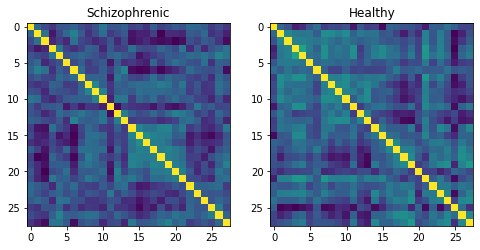

Tutorial: Learning on Tangent Data
==================================

In this notebook, we demonstrate how any standard machine learning
algorithm can be used on data that live on a manifold yet respecting its
geometry. In the previous notebooks we saw that linear operations (mean,
linear weighting) don’t work on manifold. However, to each point on a
manifold, is associated a tangent space, which is a vector space, where
all our off-the-shelf ML operations are well defined!

We will use the `logarithm
map <02_from_vector_spaces_to_manifolds.ipynb#From-substraction-to-logarithm-map>`__
to go from points of the manifolds to vectors in the tangent space at a
reference point. This will enable to use a simple logistic regression to
classify our data.

Set up
------

Before starting this tutorial, we set the working directory to be the
root of the geomstats repository. In order to have the code working on
your machine, you need to change this path to the path of your geomstats
repository.

.. code:: ipython3

    import os
    import subprocess
    
    geomstats_gitroot_path = subprocess.check_output(
        ['git', 'rev-parse', '--show-toplevel'], 
        universal_newlines=True)
    
    os.chdir(geomstats_gitroot_path[:-1])
    
    print('Working directory: ', os.getcwd())

.. parsed-literal::

    Working directory:  /code/geomstats

We import the backend that will be used for geomstats computations and
set a seed for reproducibility of the results.

.. code:: ipython3

    import geomstats.backend as gs
    
    gs.random.seed(2020)

.. parsed-literal::

    INFO: Using numpy backend

We import the visualization tools.

.. code:: ipython3

    import matplotlib.pyplot as plt

The Data
--------

We use data from the `MSLP 2014 Schizophrenia
Challenge <https://www.kaggle.com/c/mlsp-2014-mri/data>`__. The dataset
correponds to the Functional Connectivity Networks (FCN) extracted from
resting-state fMRIs of 86 patients at 28 Regions Of Interest (ROIs).
Roughly, an FCN corresponds to a correlation matrix and can be seen as a
point on the manifold of Symmetric Positive-Definite (SPD) matrices.
Patients are separated in two classes: schizophrenic and control. The
goal will be to classify them.

First we load the data (reshaped as matrices):

.. code:: ipython3

    import geomstats.datasets.utils as data_utils
    
    data, patient_ids, labels = data_utils.load_connectomes()

We plot the first two connectomes from the MSLP dataset with their
corresponding labels.

.. code:: ipython3

    labels_str = ['Healthy', 'Schizophrenic']
    
    fig = plt.figure(figsize=(8, 4))
    
    ax = fig.add_subplot(121)
    imgplot = ax.imshow(data[0])
    ax.set_title(labels_str[labels[0]])
    
    ax = fig.add_subplot(122)
    imgplot = ax.imshow(data[1])
    ax.set_title(labels_str[labels[1]])
    
    plt.show()

In order to compare with a standard Euclidean method, we also flatten
the data:

.. code:: ipython3

    flat_data, _, _ = data_utils.load_connectomes(as_vectors=True)
    print(flat_data.shape)

.. parsed-literal::

    (86, 378)

The Manifold
------------

As mentionned above, correlation matrices are SPD matrices. Because
multiple metrics could be used on SPD matrices, we also import two of
the most commonly used ones: the Log-Euclidean metric and the
Affine-Invariant metric [PFA2006]. We can use the SPD module from
``geomstats`` to handle all the geometry, and check that our data indeed
belongs to the manifold of SPD matrices:

.. code:: ipython3

    import geomstats.geometry.spd_matrices as spd
    
    manifold = spd.SPDMatrices(28)
    ai_metric = spd.SPDMetricAffine(28)
    le_metric = spd.SPDMetricLogEuclidean(28)
    print(gs.all(manifold.belongs(data)))

.. parsed-literal::

    True

The Transformer
---------------

Great! Now, although the sum of two SPD matrices is an SPD matrix, their
difference or their linear combination with non-positive weights are not
necessarily! Therefore we need to work in a tangent space to perform
simple machine learning. But worry not, all the geometry is handled by
geomstats, thanks to the preprocessing module.

.. code:: ipython3

    from geomstats.learning.preprocessing import ToTangentSpace

What ``ToTangentSpace`` does is simple: it computes the Frechet Mean of
the data set (covered in the previous tutorial), then takes the log of
each data point from the mean. This results in a set of tangent vectors,
and in the case of the SPD manifold, these are simply symmetric
matrices. It then squeezes them to a 1d-vector of size
``dim = 28 * (28 + 1) / 2``, and thus outputs an array of shape
``[n_patients, dim]``, which can be fed to your favorite scikit-learn
algorithm.

Because the mean of the input data is computed, ``ToTangentSpace``
should be used in a pipeline (as e.g. scikit-learn’s ``StandardScaler``)
not to leak information from the test set at train time.

.. code:: ipython3

    from sklearn.pipeline import Pipeline
    from sklearn.linear_model import LogisticRegression
    from sklearn.model_selection import cross_validate
    
    pipeline = Pipeline(
        steps=[('feature_ext', ToTangentSpace(geometry=ai_metric)),
               ('classifier', LogisticRegression(C=2))])

We now have all the material to classify connectomes, and we evaluate
the model with cross validation. With the affine-invariant metric we
obtain:

.. code:: ipython3

    result = cross_validate(pipeline, data, labels)
    print(result['test_score'].mean())

.. parsed-literal::

    0.7098039215686274

And with the log-Euclidean metric:

.. code:: ipython3

    pipeline = Pipeline(
        steps=[('feature_ext', ToTangentSpace(geometry=le_metric)),
               ('classifier', LogisticRegression(C=2))])
    
    result = cross_validate(pipeline, data, labels)
    print(result['test_score'].mean())

.. parsed-literal::

    0.6862745098039216

But wait, why do the results depend on the metric used? You may remember
from the previous notebooks that the Riemannian metric defines the
notion of geodesics and distance on the manifold. Both notions are used
to compute the Frechet Mean and the logarithms, so changing the metric
changes the results, and some metrics may be more suitable than others
for different applications.

We can finally compare to a standard Euclidean logistic regression on
the flattened data:

.. code:: ipython3

    flat_result = cross_validate(LogisticRegression(), flat_data, labels)
    print(flat_result['test_score'].mean())

.. parsed-literal::

    0.7333333333333334

Conclusion
----------

In this example using Riemannian geometry does not make a big difference
compared to applying logistic regression in the ambiant Euclidean space,
but there are published results that show how useful geometry can be
with this type of data (e.g [NDV2014], [WAZ2918]). We saw how to use the
representation of points on the manifold as tangent vectors at a
reference point to fit any machine learning algorithm, and compared the
effect of different metrics on the space of symmetric positive-definite
matrices

References
----------

.. [PFA2006] Pennec, X., Fillard, P. & Ayache, N. A Riemannian Framework
for Tensor Computing. Int J Comput Vision 66, 41–66 (2006).
https://doi.org/10.1007/s11263-005-3222-z

.. [NDV2014] Bernard Ng, Martin Dressler, Gaël Varoquaux, Jean-Baptiste
Poline, Michael Greicius, et al.. Transport on Riemannian Manifold for
Functional Connectivity-based Classification. MICCAI - 17th
International Conference on Medical Image Computing and Computer
Assisted Intervention, Polina Golland, Sep 2014, Boston, United States.
hal-01058521

.. [WAZ2918] Wong E., Anderson J.S., Zielinski B.A., Fletcher P.T.
(2018) Riemannian Regression and Classification Models of Brain Networks
Applied to Autism. In: Wu G., Rekik I., Schirmer M., Chung A., Munsell
B. (eds) Connectomics in NeuroImaging. CNI 2018. Lecture Notes in
Computer Science, vol 11083. Springer, Cham
