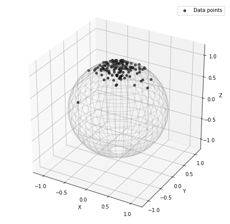
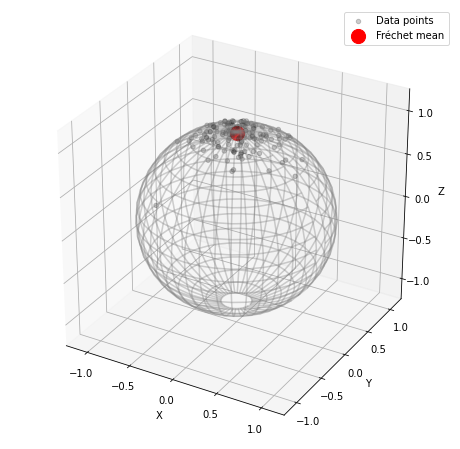
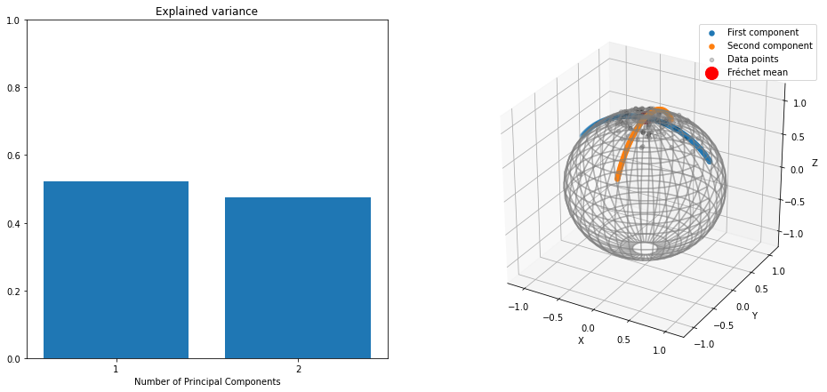
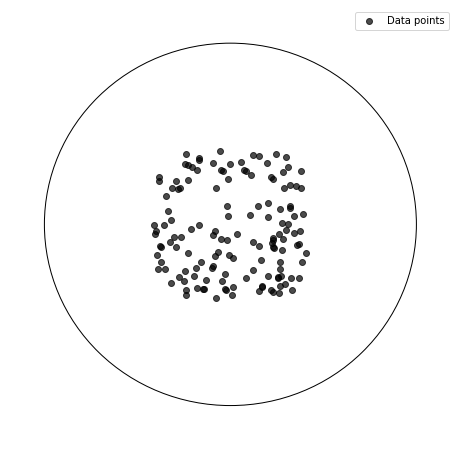
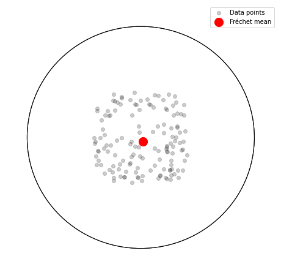
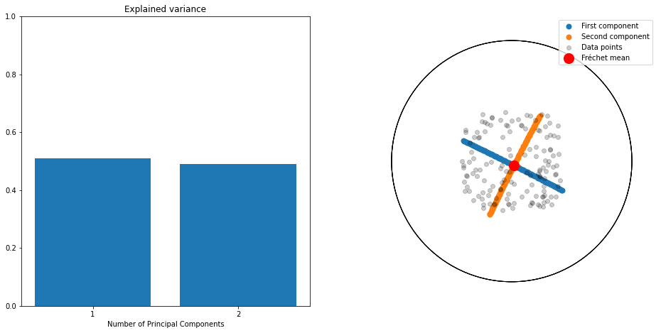

Tutorial: Fréchet Mean and Tangent PCA
======================================

This notebook shows how to compute the Fréchet mean of a data set. Then
it performs tangent PCA at the mean.

Setup
-----

Before starting this tutorial, we set the working directory to be the
root of the geomstats repository. In order to have the code working on
your machine, you need to change this path to the path of your geomstats
repository.

.. code:: ipython3

    import os
    import subprocess
    
    geomstats_gitroot_path = subprocess.check_output(
        ['git', 'rev-parse', '--show-toplevel'], 
        universal_newlines=True)
    
    os.chdir(geomstats_gitroot_path[:-1])
    
    print('Working directory: ', os.getcwd())

.. parsed-literal::

    Working directory:  /code/geomstats

.. code:: ipython3

    import matplotlib.pyplot as plt
    
    import geomstats.backend as gs
    import geomstats.visualization as visualization
    
    from geomstats.learning.frechet_mean import FrechetMean
    from geomstats.learning.pca import TangentPCA

.. parsed-literal::

    INFO: Using numpy backend

On the sphere
-------------

Generate data on the sphere
~~~~~~~~~~~~~~~~~~~~~~~~~~~

.. code:: ipython3

    from geomstats.geometry.hypersphere import Hypersphere
    
    sphere = Hypersphere(dim=2)
    data = sphere.random_von_mises_fisher(kappa=15, n_samples=140)

.. code:: ipython3

    fig = plt.figure(figsize=(8, 8))
    ax = visualization.plot(data, space='S2', color='black', alpha=0.7, label='Data points')
    ax.legend();

Fréchet mean
~~~~~~~~~~~~

We compute the Fréchet mean of the simulated data points.

.. code:: ipython3

    mean = FrechetMean(metric=sphere.metric)
    mean.fit(data)
    
    mean_estimate = mean.estimate_

.. code:: ipython3

    fig = plt.figure(figsize=(8, 8))
    ax = visualization.plot(data, space='S2', color='black', alpha=0.2, label='Data points')
    ax = visualization.plot(mean_estimate, space='S2', color='red', ax=ax, s=200, label='Fréchet mean')
    ax.legend();

Tangent PCA (at the Fréchet mean)
~~~~~~~~~~~~~~~~~~~~~~~~~~~~~~~~~

We perform tangent PCA at the Fréchet mean, with two principal
components.

.. code:: ipython3

    tpca = TangentPCA(metric=sphere.metric, n_components=2)
    tpca = tpca.fit(data, base_point=mean_estimate)
    tangent_projected_data = tpca.transform(data)

We compute the geodesics on the sphere corresponding to the two
principal components.

.. code:: ipython3

    geodesic_0 = sphere.metric.geodesic(
            initial_point=mean_estimate,
            initial_tangent_vec=tpca.components_[0])
    geodesic_1 = sphere.metric.geodesic(
            initial_point=mean_estimate,
            initial_tangent_vec=tpca.components_[1])
    
    n_steps = 100
    t = gs.linspace(-1., 1., n_steps)
    geodesic_points_0 = geodesic_0(t)
    geodesic_points_1 = geodesic_1(t) 

.. code:: ipython3

    fig = plt.figure(figsize=(16, 7))
    ax = fig.add_subplot(121)
    xticks = gs.arange(1, 2+1, 1)
    ax.xaxis.set_ticks(xticks)
    ax.set_title('Explained variance')
    ax.set_xlabel('Number of Principal Components')
    ax.set_ylim((0, 1))
    ax.bar(xticks, tpca.explained_variance_ratio_)
    
    ax = fig.add_subplot(122, projection="3d")
    
    ax = visualization.plot(
        geodesic_points_0, ax, space='S2', linewidth=2, label='First component')
    ax = visualization.plot(
        geodesic_points_1, ax, space='S2', linewidth=2, label='Second component')
    ax = visualization.plot(
        data, ax, space='S2', color='black', alpha=0.2, label='Data points')
    ax = visualization.plot(
        mean_estimate, ax, space='S2', color='red', s=200, label='Fréchet mean')
    ax.legend()
    plt.show()

In the Hyperbolic plane
-----------------------

Generate data on the hyperbolic plane
~~~~~~~~~~~~~~~~~~~~~~~~~~~~~~~~~~~~~

.. code:: ipython3

    from geomstats.geometry.hyperboloid import Hyperboloid
    
    hyperbolic_plane = Hyperboloid(dim=2)
    
    data = hyperbolic_plane.random_uniform(n_samples=140)

.. code:: ipython3

    fig = plt.figure(figsize=(8, 8))
    ax = visualization.plot(data, space='H2_poincare_disk', color='black', alpha=0.7, label='Data points')
    ax.legend();

Fréchet mean
~~~~~~~~~~~~

We compute the Fréchet mean of the data points.

.. code:: ipython3

    mean = FrechetMean(metric=hyperbolic_plane.metric)
    mean.fit(data)
    
    mean_estimate = mean.estimate_

.. code:: ipython3

    fig = plt.figure(figsize=(8, 8))
    ax = visualization.plot(data, space='H2_poincare_disk', color='black', alpha=0.2, label='Data points')
    ax = visualization.plot(mean_estimate, space='H2_poincare_disk', color='red', ax=ax, s=200, label='Fréchet mean')
    ax.legend();

Tangent PCA (at the Fréchet mean)
~~~~~~~~~~~~~~~~~~~~~~~~~~~~~~~~~

We perform tangent PCA at the Fréchet mean.

.. code:: ipython3

    tpca = TangentPCA(metric=hyperbolic_plane.metric, n_components=2)
    tpca = tpca.fit(data, base_point=mean_estimate)
    tangent_projected_data = tpca.transform(data)

We compute the geodesics corresponding to the first components of the
tangent PCA.

.. code:: ipython3

    geodesic_0 = hyperbolic_plane.metric.geodesic(
            initial_point=mean_estimate,
            initial_tangent_vec=tpca.components_[0])
    geodesic_1 = hyperbolic_plane.metric.geodesic(
            initial_point=mean_estimate,
            initial_tangent_vec=tpca.components_[1])
    
    n_steps = 100
    t = gs.linspace(-1., 1., n_steps)
    geodesic_points_0 = geodesic_0(t)
    geodesic_points_1 = geodesic_1(t) 

.. code:: ipython3

    fig = plt.figure(figsize=(16, 7.5))
    ax = fig.add_subplot(121)
    xticks = gs.arange(1, 2+1, 1)
    ax.xaxis.set_ticks(xticks)
    ax.set_title('Explained variance')
    ax.set_xlabel('Number of Principal Components')
    ax.set_ylim((0, 1))
    ax.bar(xticks, tpca.explained_variance_ratio_)
    
    ax = fig.add_subplot(122)
    
    ax = visualization.plot(
        geodesic_points_0, ax, space='H2_poincare_disk', linewidth=2, label='First component')
    ax = visualization.plot(
        geodesic_points_1, ax, space='H2_poincare_disk', linewidth=2, label='Second component')
    ax = visualization.plot(
        data, ax, space='H2_poincare_disk', color='black', alpha=0.2, label='Data points')
    ax = visualization.plot(
        mean_estimate, ax, space='H2_poincare_disk', color='red', s=200, label='Fréchet mean')
    ax.legend()
    plt.show()

