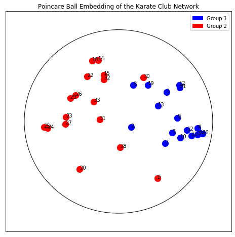
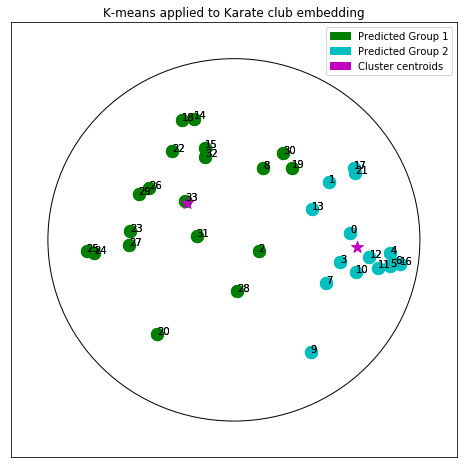

Tutorial: Hyperbolic Embedding of Graphs
========================================

Introduction
------------

From social networks to parse trees, knowledge graphs to protein
interaction networks, Graph-Structured Data is endemic to a wide variety
of natural and engineered systems. Often, understanding the structure
and/or dynamics of these graphs yields insight into the systems under
investigation. Take, for example, the problems of finding key
influencers or distinct communities within social networks.

The goal of graph embedding is to find a way of representing the graph
in a space which more readily lends itself to analysis/investigation.
One approach is to identify points in a vector space with nodes of the
graph in such a way that important relations between nodes are preserved
via relations between their corresponding points.

There are a wide variety of methods which approach this problem in
different ways and for different aims, say for clustering or for link
prediction. Recently, the embedding of Graph Structured Data (GSD) on
manifolds has received considerable attention. In particular, much work
has shown that hyperbolic spaces are beneficial for a wide variety of
tasks with GSD. This tutorial shows how to learn such embeddings using
the Poincaré Ball manifold and the well-known ‘Karate Club’ social
network dataset with ``geomstats``. This data and several others can be
found in the ``datasets.data`` module of the project’s github
repository.

|KarateEmbedding| *Learning a Poincaré disk embedding of the Karate club
graph dataset*

.. |KarateEmbedding| image:: figures/karate_embedding_iterations.gif

Setup
-----

We start by importing standard tools for logging and visualization,
allowing us to draw the embedding of the GSD on the manifold. Next, we
import the manifold of interest, visualization tools, and other methods
from ``geomstats``.

.. code:: ipython3

    import logging
    import matplotlib.pyplot as plt
    
    import geomstats.backend as gs
    import geomstats.visualization as visualization
    
    from geomstats.datasets.utils import load_karate_graph
    from geomstats.geometry.poincare_ball import PoincareBall

.. parsed-literal::

    INFO: Using numpy backend

Parameters and Initialization
-----------------------------

We define the following parameters needed for embedding:

+-----------------------------------+-----------------------------------+
| Parameter                         | Description                       |
+===================================+===================================+
| random.seed                       | An initial manually set number    |
|                                   | for generating pseudorandom       |
|                                   | numbers                           |
+-----------------------------------+-----------------------------------+
| dim                               | Dimensions of the manifold used   |
|                                   | for embedding                     |
+-----------------------------------+-----------------------------------+
| max_epochs                        | Number of iterations for learning |
|                                   | the embedding                     |
+-----------------------------------+-----------------------------------+
| lr                                | Learning rate                     |
+-----------------------------------+-----------------------------------+
| n_negative                        | Number of negative samples        |
+-----------------------------------+-----------------------------------+
| context_size                      | Size of the considered context    |
|                                   | for each node of the graph        |
+-----------------------------------+-----------------------------------+

Let us discuss a few things about the parameters of the above table. The
number of dimensions should be high (i.e., 10+) for large datasets
(i.e., where the number of nodes/edges is significantly large). In this
tutorial we consider a dataset that is quite small with only 34 nodes.
The Poincaré disk of only two dimensions is therefore sufficient to
capture the complexity of the graph and provide a faithful
representation. Some parameters are hard to know in advance, such as
``max_epochs`` and ``lr``. These should be tuned specifically for each
dataset. Visualization can help with tuning the parameters. Also, one
can perform a grid search to find values of these parameters which
maximize some performance function. In learning embeddings, one can
consider performance metrics such as a measure for cluster seperability
or normalized mutual information (NMI) or others. Similarly, the number
of negative samples and context size can also be thought of as
hyperparameters and will be further discussed in the sequel. An instance
of the ``Graph`` class is created and set to the Karate club dataset.

.. code:: ipython3

    gs.random.seed(1234)
    dim = 2
    max_epochs = 100
    lr = .05
    n_negative = 2
    context_size = 1
    karate_graph = load_karate_graph()

The Zachary karate club network was collected from the members of a
university karate club by Wayne Zachary in 1977. Each node represents a
member of the club, and each edge represents an undirected relation
between two members. An often discussed problem using this dataset is to
find the two groups of people into which the karate club split after an
argument between two teachers. Some information about the dataset is
displayed to provide insight into its complexity.

.. code:: ipython3

    nb_vertices_by_edges =\
        [len(e_2) for _, e_2 in karate_graph.edges.items()]
    logging.info('Number of vertices: %s', len(karate_graph.edges))
    logging.info(
        'Mean edge-vertex ratio: %s',
        (sum(nb_vertices_by_edges, 0) / len(karate_graph.edges)))

.. parsed-literal::

    INFO: Number of vertices: 34
    INFO: Mean edge-vertex ratio: 4.588235294117647

Denote :math:`V` as the set of nodes and :math:`E \subset V\times V` the
set of edges. The goal of embedding GSD is to provide a faithful and
exploitable representation of the graph structure. It is mainly achieved
by preserving *first-order* proximity that enforces nodes sharing edges
to be close to each other. It can additionally preserve *second-order*
proximity that enforces two nodes sharing the same context (i.e., nodes
that share neighbors but are not necessarily directly connected) to be
close. Let :math:`\mathbb{B}^m` be the Poincaré Ball of dimension
:math:`m` equipped with the distance function :math:`d`. The below
figure shows geodesics between pairs of points on :math:`\mathbb{B}^2`.
Geodesics are the shortest path between two points. The distance
function :math:`d` of two points is the length of the geodesic that
links them.

Declaring an instance of the ``PoincareBall`` manifold of two dimensions
in ``geomstats`` is straightforward:

.. code:: ipython3

    hyperbolic_manifold = PoincareBall(2)

*first* and *second-order* proximities can be achieved by optimising the
following loss functions:

Loss function.
--------------

To preserve first and second-order proximities we adopt a loss function
similar to (Nickel, 2017) and consider the negative sampling approach as
in (Mikolov, 2013) :

.. math::      \mathcal{L} = - \sum_{v_i\in V} \sum_{v_j \in C_i} \bigg[ log(\sigma(-d^2(\phi_i, \phi_j'))) + \sum_{v_k\sim \mathcal{P}_n} log(\sigma(d^2(\phi_i, \phi_k')))  \bigg]

where :math:`\sigma(x)=\frac{1}{1+e^{-x}}` is the sigmoid function and
:math:`\phi_i \in \mathbb{B}^m` is the embedding of the :math:`i`-th
node of :math:`V`, :math:`C_i` the nodes in the context of the
:math:`i`-th node, :math:`\phi_j'\in \mathbb{B}^m` the embedding of
:math:`v_j\in C_i` and :math:`\mathcal{P}_n` the negative sampling
distribution over :math:`V`:
:math:`\mathcal{P}_n(v)=\frac{deg(v)^{3/4}}{\sum_{v_i\in V}deg(v_i)^{3/4}}`.
Intuitively one can see that to minimizing :math:`L`, the distance
between :math:`v_i` and :math:`v_j` should get smaller, while the one
between :math:`v_i` and :math:`v_k` would get larger.

Riemannian optimization.
------------------------

Following the idea of (Ganea, 2018) we use the following formula to
optimize :math:`L`:

.. math::  \phi^{t+1} = \text{Exp}_{\phi^t} \left( -lr \frac{\partial L}{\partial \phi} \right) 

where :math:`\phi` is a parameter of :math:`L`,
:math:`t\in\{1,2,\cdots\}` is the epoch iteration number and :math:`lr`
is the learning rate. The formula consists of first computing the usual
gradient of the loss function giving the direction in which the
parameter should move. The Riemannian exponential map :math:`\text{Exp}`
is a function that takes a base point :math:`\phi^t` and some direction
vector :math:`T` and returns the point :math:`\phi^{t+1}` such that
:math:`\phi^{t+1}` belongs to the geodesic initiated from
:math:`\phi{t}` in the direction of :math:`T` and the length of the
geoedesic curve between :math:`\phi^t` and :math:`\phi^{t+1}` is of 1
unit. The Riemannian exponential map is implemented as a method of the
``PoincareBallMetric`` class in the ``geometry`` module of
``geomstats``.

Therefore to minimize :math:`L` we will need to compute its gradient.
Several steps are required to do so, 1. Compute the gradient of the
squared distance 2. Compute the gradient of the log sigmoid 3. Compute
the gradient of the composision of 1. and 2.

For 1., we use the formula proposed by (Arnaudon, 2013) which uses the
Riemannian logarithmic map to compute the gradient of the distance. This
is implemented as

.. code:: ipython3

    def grad_squared_distance(point_a, point_b):
        """Gradient of squared hyperbolic distance.
    
        Gradient of the squared distance based on the
        Ball representation according to point_a
    
        Parameters
        ----------
        point_a : array-like, shape=[n_samples, dim]
            First point in hyperbolic space.
        point_b : array-like, shape=[n_samples, dim]
            Second point in hyperbolic space.
    
        Returns
        -------
        dist : array-like, shape=[n_samples, 1]
            Geodesic squared distance between the two points.
        """
        hyperbolic_metric = PoincareBall(2).metric
        log_map = hyperbolic_metric.log(point_b, point_a)
    
        return -2 * log_map

For 2. define the ``log_sigmoid`` corresponding as follows:

.. code:: ipython3

    def log_sigmoid(vector):
        """Logsigmoid function.
    
        Apply log sigmoid function
    
        Parameters
        ----------
        vector : array-like, shape=[n_samples, dim]
    
        Returns
        -------
        result : array-like, shape=[n_samples, dim]
        """
        return gs.log((1 / (1 + gs.exp(-vector))))

The gradient of the logarithm of sigmoid function is implemented as:

.. code:: ipython3

    def grad_log_sigmoid(vector):
        """Gradient of log sigmoid function.
    
        Parameters
        ----------
        vector : array-like, shape=[n_samples, dim]
    
        Returns
        -------
        gradient : array-like, shape=[n_samples, dim]
        """
        return 1 / (1 + gs.exp(vector))

For 3., apply the composition rule to obtain the gradient of :math:`L`.
The following function given :math:`\phi_i`, :math:`\phi'_j` and
:math:`\phi'_k` returns the total value of :math:`L` and its gradient
vector at :math:`\phi_i`. For the value of :math:`L` the loss function
formula is simply applied. For the gradient, we apply the composition of
``grad_log_sigmoid`` with ``grad_squared_distance`` while paying
attention to the signs.

.. code:: ipython3

    def loss(example_embedding, context_embedding, negative_embedding,
             manifold):
        """Compute loss and grad.
    
        Compute loss and grad given embedding of the current example,
        embedding of the context and negative sampling embedding.
        """
        n_edges, dim =\
            negative_embedding.shape[0], example_embedding.shape[-1]
        example_embedding = gs.expand_dims(example_embedding, 0)
        context_embedding = gs.expand_dims(context_embedding, 0)
        positive_distance =\
            manifold.metric.squared_dist(
                example_embedding, context_embedding)
        positive_loss =\
            log_sigmoid(-positive_distance)
    
        reshaped_example_embedding =\
            gs.repeat(example_embedding, n_edges, axis=0)
        negative_distance =\
            manifold.metric.squared_dist(
                reshaped_example_embedding, negative_embedding)
        negative_loss = log_sigmoid(negative_distance)
    
        total_loss = -(positive_loss + negative_loss.sum())
    
        positive_log_sigmoid_grad =\
            -grad_log_sigmoid(-positive_distance)
    
        positive_distance_grad =\
            grad_squared_distance(example_embedding, context_embedding)
    
        positive_grad =\
            gs.repeat(positive_log_sigmoid_grad, dim, axis=-1)\
            * positive_distance_grad
    
        negative_distance_grad =\
            grad_squared_distance(reshaped_example_embedding, negative_embedding)
    
        negative_distance = gs.to_ndarray(negative_distance,
                                          to_ndim=2, axis=-1)
        negative_log_sigmoid_grad =\
            grad_log_sigmoid(negative_distance)
    
        negative_grad = negative_log_sigmoid_grad\
            * negative_distance_grad
        example_grad = -(positive_grad + negative_grad.sum(axis=0))
    
        return total_loss, example_grad

Capturing the graph structure
-----------------------------

At this point we have the necessary bricks to compute the resulting
gradient of :math:`L`. We are ready to prepare the nodes :math:`v_i`,
:math:`v_j` and :math:`v_k` and initialise their embeddings
:math:`\phi_i`, :math:`\phi^{'}_j` and :math:`\phi^{'}_k`. First,
initialize an array that will hold embeddings :math:`\phi_i` of each
node :math:`v_i\in V` with random points belonging to the Poincaré disk.

.. code:: ipython3

    embeddings = gs.random.normal(size=(karate_graph.n_nodes, dim))
    embeddings = embeddings * 0.2

Next, to prepare the context nodes :math:`v_j` for each node
:math:`v_i`, we compute random walks initialised from each :math:`v_i`
up to some length (5 by default). The latter is done via a special
function within the ``Graph`` class. The nodes :math:`v_j` will be later
picked from the random walk of :math:`v_i`.

.. code:: ipython3

    random_walks = karate_graph.random_walk()

Negatively sampled nodes :math:`v_k` are chosen according to the
previously defined probability distribution function
:math:`\mathcal{P}_n(v_k)` implemented as

.. code:: ipython3

    negative_table_parameter = 5
    negative_sampling_table = []
    
    for i, nb_v in enumerate(nb_vertices_by_edges):
        negative_sampling_table +=\
            ([i] * int((nb_v**(3. / 4.))) * negative_table_parameter)
    
    negative_sampling_table = gs.array(negative_sampling_table)

Numerically optimizing the loss function
----------------------------------------

Optimising the loss function is performed numerically over the number of
epochs. At each iteration, we will compute the gradient of :math:`L`.
Then the graph nodes are moved in the direction pointed by the gradient.
The movement of the nodes is performed by following geodesics in the
gradient direction. The key to obtain an embedding representing
accurately the dataset, is to move the nodes smoothly rather than brutal
movements. This is done by tuning the learning rate, such as at each
epoch all the nodes made small movements.

A *first level* loop iterates over the epochs, the table ``total_loss``
will record the value of :math:`L` at each iteration and help us track
the minimization of :math:`L`.

A *second level* nested loop iterates over each path in the previously
computed random walks. Observing these walks, notice that nodes having
many edges appear more often. Such nodes can be considered as important
crossroads and will therefore be subject to a greater number of
embedding updates. This is one of the main reasons why random walks have
proven to be effective in capturing the structure of graphs. The context
of each :math:`v_i` will be the set of nodes :math:`v_j` belonging to
the random walk from :math:`v_i`. The ``context_size`` specified earlier
will limit the length of the walk to be considered. Similarly, we use
the same ``context_size`` to limit the number of negative samples. We
find :math:`\phi_i` from the ``embeddings`` array.

A *third level* nested loop will iterate on each :math:`v_j` and
:math:`v_k`. From within, we find :math:`\phi'_j` and :math:`\phi'_k`
then call the ``loss`` function to compute the gradient. Then the
Riemannian exponential map is applied to find the new value of
:math:`\phi_i` as we mentioned before.

.. code:: ipython3

    for epoch in range(max_epochs):
        total_loss = []
        for path in random_walks:
    
            for example_index, one_path in enumerate(path):
                context_index = path[max(0, example_index - context_size):
                                     min(example_index + context_size,
                                     len(path))]
                negative_index =\
                    gs.random.randint(negative_sampling_table.shape[0],
                                      size=(len(context_index),
                                      n_negative))
                negative_index = negative_sampling_table[negative_index]
    
                example_embedding = embeddings[one_path]
                for one_context_i, one_negative_i in zip(context_index,
                                                         negative_index):
                    context_embedding = embeddings[one_context_i]
                    negative_embedding = embeddings[one_negative_i]
                    l, g_ex = loss(
                        example_embedding,
                        context_embedding,
                        negative_embedding,
                        hyperbolic_manifold)
                    total_loss.append(l)
    
                    example_to_update = embeddings[one_path]
                    embeddings[one_path] = hyperbolic_manifold.metric.exp(
                        -lr * g_ex, example_to_update)
        logging.info(
            'iteration %d loss_value %f',
            epoch, sum(total_loss, 0) / len(total_loss))

.. parsed-literal::

    INFO: iteration 0 loss_value 1.826876
    INFO: iteration 1 loss_value 1.774560
    INFO: iteration 2 loss_value 1.725700
    INFO: iteration 3 loss_value 1.663358
    INFO: iteration 4 loss_value 1.655706
    INFO: iteration 5 loss_value 1.615405
    INFO: iteration 6 loss_value 1.581097
    INFO: iteration 7 loss_value 1.526418
    INFO: iteration 8 loss_value 1.507913
    INFO: iteration 9 loss_value 1.505934
    INFO: iteration 10 loss_value 1.466526
    INFO: iteration 11 loss_value 1.453769
    INFO: iteration 12 loss_value 1.443878
    INFO: iteration 13 loss_value 1.451272
    INFO: iteration 14 loss_value 1.397864
    INFO: iteration 15 loss_value 1.396170
    INFO: iteration 16 loss_value 1.373677
    INFO: iteration 17 loss_value 1.390120
    INFO: iteration 18 loss_value 1.382397
    INFO: iteration 19 loss_value 1.404103
    INFO: iteration 20 loss_value 1.395782
    INFO: iteration 21 loss_value 1.389617
    INFO: iteration 22 loss_value 1.410152
    INFO: iteration 23 loss_value 1.390600
    INFO: iteration 24 loss_value 1.374832
    INFO: iteration 25 loss_value 1.367194
    INFO: iteration 26 loss_value 1.323190
    INFO: iteration 27 loss_value 1.389616
    INFO: iteration 28 loss_value 1.361034
    INFO: iteration 29 loss_value 1.384930
    INFO: iteration 30 loss_value 1.340814
    INFO: iteration 31 loss_value 1.349682
    INFO: iteration 32 loss_value 1.317423
    INFO: iteration 33 loss_value 1.346869
    INFO: iteration 34 loss_value 1.327198
    INFO: iteration 35 loss_value 1.363809
    INFO: iteration 36 loss_value 1.352347
    INFO: iteration 37 loss_value 1.317670
    INFO: iteration 38 loss_value 1.320039
    INFO: iteration 39 loss_value 1.323888
    INFO: iteration 40 loss_value 1.341444
    INFO: iteration 41 loss_value 1.312259
    INFO: iteration 42 loss_value 1.315983
    INFO: iteration 43 loss_value 1.305483
    INFO: iteration 44 loss_value 1.325384
    INFO: iteration 45 loss_value 1.328024
    INFO: iteration 46 loss_value 1.306958
    INFO: iteration 47 loss_value 1.303357
    INFO: iteration 48 loss_value 1.303790
    INFO: iteration 49 loss_value 1.324749
    INFO: iteration 50 loss_value 1.328376
    INFO: iteration 51 loss_value 1.313816
    INFO: iteration 52 loss_value 1.325978
    INFO: iteration 53 loss_value 1.317516
    INFO: iteration 54 loss_value 1.353495
    INFO: iteration 55 loss_value 1.331988
    INFO: iteration 56 loss_value 1.346874
    INFO: iteration 57 loss_value 1.348946
    INFO: iteration 58 loss_value 1.324719
    INFO: iteration 59 loss_value 1.330355
    INFO: iteration 60 loss_value 1.331077
    INFO: iteration 61 loss_value 1.305729
    INFO: iteration 62 loss_value 1.311746
    INFO: iteration 63 loss_value 1.347637
    INFO: iteration 64 loss_value 1.326300
    INFO: iteration 65 loss_value 1.309570
    INFO: iteration 66 loss_value 1.313999
    INFO: iteration 67 loss_value 1.346287
    INFO: iteration 68 loss_value 1.300901
    INFO: iteration 69 loss_value 1.323723
    INFO: iteration 70 loss_value 1.320784
    INFO: iteration 71 loss_value 1.313709
    INFO: iteration 72 loss_value 1.312143
    INFO: iteration 73 loss_value 1.309172
    INFO: iteration 74 loss_value 1.320642
    INFO: iteration 75 loss_value 1.308333
    INFO: iteration 76 loss_value 1.325884
    INFO: iteration 77 loss_value 1.316740
    INFO: iteration 78 loss_value 1.325933
    INFO: iteration 79 loss_value 1.316672
    INFO: iteration 80 loss_value 1.312291
    INFO: iteration 81 loss_value 1.332372
    INFO: iteration 82 loss_value 1.317499
    INFO: iteration 83 loss_value 1.329194
    INFO: iteration 84 loss_value 1.305926
    INFO: iteration 85 loss_value 1.304747
    INFO: iteration 86 loss_value 1.342343
    INFO: iteration 87 loss_value 1.331992
    INFO: iteration 88 loss_value 1.295439
    INFO: iteration 89 loss_value 1.332853
    INFO: iteration 90 loss_value 1.332004
    INFO: iteration 91 loss_value 1.357248
    INFO: iteration 92 loss_value 1.342234
    INFO: iteration 93 loss_value 1.329379
    INFO: iteration 94 loss_value 1.313617
    INFO: iteration 95 loss_value 1.310320
    INFO: iteration 96 loss_value 1.320590
    INFO: iteration 97 loss_value 1.315822
    INFO: iteration 98 loss_value 1.328819
    INFO: iteration 99 loss_value 1.339718

Plotting results
----------------

Once the ``max_epochs`` iterations of epochs is achieved, we can plot
the resulting ``embeddings`` array and the true labels shown as two
colors. At 100 epochs we can see that the two group of nodes with
different labels are moving away from each other on the manifold. If one
increases the ``max_epochs``, then further separability is achieved.

.. code:: ipython3

    import matplotlib.patches as mpatches
    
    colors = {1: 'b', 2: 'r'}
    group_1 = mpatches.Patch(color=colors[1], label='Group 1')
    group_2 = mpatches.Patch(color=colors[2], label='Group 2')
    
    circle = visualization.PoincareDisk(point_type='ball')
    
    fig, ax = plt.subplots(figsize=(8, 8))
    ax.axes.xaxis.set_visible(False)
    ax.axes.yaxis.set_visible(False)
    circle.set_ax(ax)
    circle.draw(ax=ax)
    for i_embedding, embedding in enumerate(embeddings):
        x = embedding[0]
        y = embedding[1]
        pt_id = i_embedding
        plt.scatter(
            x, y,
            c=colors[karate_graph.labels[pt_id][0]],
            s = 150
            )
        ax.annotate(pt_id, (x,y))
    
    plt.tick_params(
    which='both')
    plt.title('Poincare Ball Embedding of the Karate Club Network')
    plt.legend(handles=[group_1, group_2])
    plt.show()

In ``geomstats``, several unsupervized clustering algorithms on
manifolds are implemented such as :math:`K`-means and
Expectation-Maximization.

Let us apply :math:`K`-means to learn the node belonging of the two
groups and see how well we predicted the true labels. Lets first import
:math:`K`-means

.. code:: ipython3

    from geomstats.learning.kmeans import RiemannianKMeans

Set the number of groups to 2.

.. code:: ipython3

    n_clusters = 2

Initialize an instance of :math:`K`-means.

.. code:: ipython3

    kmeans = RiemannianKMeans(metric= hyperbolic_manifold.metric,
                              n_clusters=n_clusters,
                              init='random',
                              mean_method='frechet-poincare-ball'
                                  )

Fit the embedded nodes

.. code:: ipython3

    centroids = kmeans.fit(X=embeddings, max_iter=100)
    labels = kmeans.predict(X=embeddings)

And plot the resulting labels provided by :math:`K`-means

.. code:: ipython3

    colors = ['g', 'c', 'm']
    circle = visualization.PoincareDisk(point_type='ball')
    fig2, ax2 = plt.subplots(figsize=(8, 8))
    circle.set_ax(ax2)
    circle.draw(ax=ax2)
    ax2.axes.xaxis.set_visible(False)
    ax2.axes.yaxis.set_visible(False)
    group_1_predicted = mpatches.Patch(color=colors[0], label='Predicted Group 1')
    group_2_predicted = mpatches.Patch(color=colors[1], label='Predicted Group 2')
    group_centroids = mpatches.Patch(color=colors[2], label='Cluster centroids')
    
    for i in range(n_clusters):
        for i_embedding, embedding in enumerate(embeddings):
            x = embedding[0]
            y = embedding[1]
            pt_id = i_embedding
            if labels[i_embedding] == 0:
                color = colors[0]
            else:
                color = colors[1]
            plt.scatter(
                x, y,
                c=color,
                s = 150
                )
            ax2.annotate(pt_id, (x,y))
    
    for i_centroid, centroid in enumerate(centroids): 
        x = centroid[0]
        y = centroid[1]
        plt.scatter(
            x, y,
            c=colors[2],
            marker='*',
            s = 150,
            )
    
    plt.title('K-means applied to Karate club embedding')
    plt.legend(handles = [group_1_predicted, group_2_predicted, group_centroids])
    plt.show()

By comparing the :math:`K`-means labels and the true labels, notice how
:math:`K`-means accurately finds the two groups of nodes (not perfectly,
e.g., nodes 2 and 8). We therefore achieved good performances in
predicting the belonging of each member of the Karate club to one of the
two groups.

References
----------

(Arnaudon, 2013) Arnaudon, Marc, Frédéric Barbaresco, and Le Yang.
“Riemannian medians and means with applications to radar signal
processing.” IEEE Journal of Selected Topics in Signal Processing 7.4
(2013): 595-604.

(Ganea, 2018) Ganea, Octavian, Gary Bécigneul, and Thomas Hofmann.
“Hyperbolic neural networks.” Advances in neural information processing
systems. 2018.

(Mikolov, 2013) Mikolov, Tomas, et al. “Distributed representations of
words and phrases and their compositionality.” Advances in neural
information processing systems. 2013.

(Nickel, 2017) Nickel, Maximillian, and Douwe Kiela. “Poincaré
embeddings for learning hierarchical representations.” Advances in
neural information processing systems. 2017.
