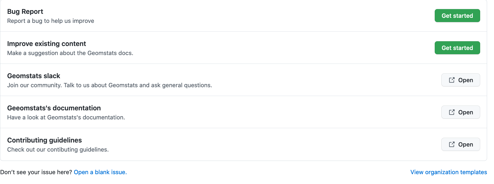

.. _contributing:

==================
Contributing Guide
==================

This is an exhaustive guide to ease the contribution
process for both novice and experienced contributors.
`Geomstats <https://github.com/geomstats/geomstats>`_ is a 
community effort, and everyone is welcome to contribute.

.. _dev-setup:

Development Setup
=================

The instructions in this section detail the step-by-step
process on setting up your development environment before
contribution. One can also use it as a development checklist
for an overview of development steps.

.. _source-control:

Source control with Git
-----------------------

The Geomstats project is available on `GitHub <https://github.com/geomstats/geomstats>`_ and uses `Git` for source control to allow collaboration.
Typical interaction with the project involves using `git` to pull/push code and 
submitting bugs/feature requests to the `geomstats repository <https://github.com/geomstats/geomstats>`_.

Be sure to follow the Git installation and configuration instructions for your
respective operating system from the 
`official Git documentation <https://git-scm.com/book/en/v2/Getting-Started-Installing-Git>`_, 
before you follow along the next section of this documentation.

.. note::
   For more basic information about the `git` command line client, refer to 
   this `detailed tutorial <https://docs.github.com/en/get-started/using-git/about-git>`_.
   You can also checkout `GUI options <https://git-scm.com/downloads/guis/>`_.

.. _getting-the-code:

Getting the code
-----------------

For development, you have to get the geomstats source code to your local machine first,
from the project GitHub repository using the following instructions:

#. Using your browser, go to `github.com <https://github.com>`_ and create an account if you don't have one.

#. While there, navigate to the `geomstats repository <https://github.com/geomstats/geomstats>`_.

#. Fork the repository, obtaining your own copy. You can do this  using a button at the top right corner on github, under your username. The following link will become available then:

    .. code-block:: bash

      https://github.com/<username>/geomstats
   

#. Clone your forked repository using:

    .. code-block:: bash

      $ git clone https://github.com/<username>/geomstats

    or via `ssh` if you've set up SSH keys in your account:

    .. code-block:: bash

      $ git clone git@github.com:<username>/geomstats.git

#. It is recommended practice to add the main geomstats repository as the upstream remote repository:

    .. code-block:: bash

      $ cd geomstats
      $ git remote add upstream https://github.com/geomstats/geomstats.git

   This is so that later you can bring the upstream updates locally by doing:

       .. code-block:: bash

          $ git pull upstream main

#. Verify your remote configuration:

    .. code-block:: bash

      $ git remote -v
      upstream	https://github.com/geomstats/geomstats (fetch)
      upstream	https://github.com/geomstats/geomstats (push)
      origin	https://github.com/<username>/geomstats (fetch)
      origin	https://github.com/<username>/geomstats (push)

#. | At this point you have the geomstats code on your machine ready for development. Create a new development branch where the new changes will be commited:

    .. code-block:: bash

      $ git checkout -b <branch-name>
   
   (`main` could have been used to develop new code. Nevertheless, the process is cleaner if you create a new branch - e.g. the merge from upstream is easier to handle when there's conflicts - and allows you to develop several features independently, each in its own branch.)

#. Verify that you are on the new branch:

    .. code-block:: bash

      $ git branch
      * <branch-name>
        main

.. _dependencies

Dependencies and a virtual environment
---------------------------------------

We recommend using `conda virtual environments <https://docs.conda.io/projects/conda/en/latest/user-guide/tasks/manage-environments.html>`_ to separate your development environment from any other geomstats versions installed on your system (this simplifies e.g. requirements management). 

From the geomstats folder, create a virtual environment:

    .. code-block:: bash

      $ conda create -n geomstats-312 python=3.12

This command will create a new environment named `geomstats-312`.

Then, activate the environment and install geomstats in editable mode:

  .. code-block:: bash

    $ conda activate geomstats-312
    $ pip install -e .

Editable mode means that your changes in geomstats will be immediately reflected in any code that runs within this environment.

.. note::
  `venv <https://docs.python.org/3/library/venv.html>`_ is an alternative for creating lightweight environments.

.. note::
   See the `pyproject.toml` file for details on all project requirements.

.. _backends-dev

Backends
--------

Geomstats supports several backends, namely: `numpy <https://numpy.org/doc/>`_ , 
`autograd <https://autograd.readthedocs.io/en/latest/>`_,
`pytorch <https://pytorch.org/docs/stable/index.html>`_.

The default backend is `numpy`, install the other backends using:

    .. code-block:: bash  

      $ pip install -e .[<backend_name>]

Then use an environment variable to set the backend:

    .. code-block:: bash

      $ export GEOMSTATS_BACKEND=<backend_name>

.. _run tests

Run the tests
--------------

Geomstats tests can be run using `pytest <https://docs.pytest.org/en/7.1.x/>`_.
To run tests with `pytest`, first install the required packages:

    .. code-block:: bash 

      $ pip install -e .[test]

Then run all tests using:

    .. code-block:: bash 

      $ pytest tests

Optionally, run a particular test file using:

    .. code-block:: bash 

      $ pytest tests/test_geomstats/<test_filename.py>

Alternatively, run only the package tests using:

   .. code-block:: bash 

         $ tests/tests_geomstats

Or only the notebooks and scripts using:

.. code-block:: bash 

         $ tests/tests_scripts

.. _build-the-docs:

Build the docs
--------------

Documentation in the geomstats project is implemented using `sphinx`.
Install the sphinx dependencies using:

    .. code-block:: bash 

      $ pip install -e .[doc]

Then while in the project root folder, build the docs using:

    .. code-block:: bash 

      $ cd docs
      $ make html

.. note::

  The steps in this section are unix-specific, for windows users, consult the `official documentation <http://gnuwin32.sourceforge.net/packages/make.htm>`_ on how to install and use `make`.

Folder Structure
=================

When you open the Geomstats github page, you will see the top-level directories of the package. 
Below is a description of each directory.

geomstats

  Has the core implementation of the geomstats package features like 
  geometry, distributions, learning, visualization etc.

tests

  Has unit tests for the core library features.

docs

  Has the official documentation found at https://geomstats.github.io.

benchmarks

  Has code for benchmarking several aspects of geomstats.

examples

  Has sample code demonstrating different geomstats features.

notebooks

  Has example code.

Testing
========

Test Driven Development
-------------------------

High-quality `unit testing <https://en.wikipedia.org/wiki/Unit_testing>`_
is a corner-stone of the geomstats development process.
The tests consist of classes appropriately named, located in the `tests`
subdirectory, that check the validity of the algorithms and the
different options of the code.

TDD with pytest
-----------------

Geomstats uses the `pytest` Python tool for testing different functions and features.
Install the test requirements using:

    .. code-block:: bash 

      $ pip install -e .[test]

By convention all test functions should be located in files with file names
that start with `test_`. For example a unit test that exercises the Python
addition functionality can be written as follows:

    .. code-block:: bash 

      # test_add.py

      def add(x, y):
         return x + y

      def test_capital_case():
         assert add(4, 5) == 9

Use an `assert` statement to check that the function under test returns
the correct output. Then run the test using:

    .. code-block:: bash 

      $ pytest test_add.py

.. _run-tests-geomstats

Writing tests for geomstats
----------------------------

For each function `my_fun` that you implement in a given `my_module.py`, 
you should add the corresponding test
function `test_my_fun` in the file `test_my_module.py`. 

We expect code coverage of new features to be at least 90%, which is 
automatically verified by the `codecov` software when you submit a PR. 
You should also add `test_my_fun_vect` tests to ensure that your code 
is vectorized.

Running tests
--------------

First, run the tests related to your changes. For example, if you changed
something in `geomstats/spd_matrices_space.py`, you can run tests by file name:

    .. code-block:: bash 

      $ pytest tests/tests_geomstats/test_spd_matrices.py

Then run the tests of the whole codebase to check that your feature is
not breaking anything:

    .. code-block:: bash 

      $ pytest tests/test_geomstats/

This way, further modifications on the code base are guaranteed
to be consistent with the desired behavior. Merging your PR 
should not break any test.

Workflow of a contribution 
===========================

The best way to start contributing is by finding a part of the project that is more familiar to you (e.g. a specific manifold or metric, a learning algorithm, etc). Instead, if these concepts are new to you and you would like to contribute while learning, look at some of the existing issues.

.. _new-contributors:

Create or choose an issue for new contributors
----------------------------------------------

New contributors should look for the following tags when searching for issues.  We
strongly recommend that new contributors tackle `easy` issues first. This helps
the contributor become familiar with the contribution workflow, and for the core
devs to become acquainted with the contributor; besides, we frequently
underestimate how easy an issue is to solve!

.. topic:: good first issue tag

    A great way to start contributing to geomstats is to pick an item from
    the list of `good first issues
    <https://github.com/geomstats/geomstats/issues?q=is%3Aopen+is%3Aissue+label%3A%22good+first+issue%22>`_
    in the issue tracker. Resolving these issues will allow you to start contributing
    to the project without much prior knowledge. If you have already contributed
    to geomstats, you should look at easy issues instead.

.. topic:: starter project tag

    If you have already contributed to geomstats, another great way to contribute
    to geomstats is to pick an item from the list of `starter project
    <https://github.com/geomstats/geomstats/labels/starter%project>`_ in the issue
    tracker. Your assistance in this area will be greatly appreciated by the
    more experienced developers as it helps free up their time to concentrate on
    other issues.

.. topic:: help wanted tag

    We often use the help wanted tag to mark issues regardless of difficulty. Additionally,
    we use the help wanted tag to mark Pull Requests which have been abandoned
    by their original contributor and are available for someone to pick up where the original
    contributor left off. The list of issues with the help wanted tag can be found
    `here <https://github.com/geomstats/geomstats/labels/help%20wanted>`__ .

    Note that not all issues which need contributors will have this tag.

Making changes
---------------

The preferred way to contribute to geomstats is to fork the `main
repository <https://github.com/geomstats/geomstats/>`__ and submit a "pull request" (PR).

Follow the guidelines detailed in :ref:`getting-the-code` to setup the development environment.
Then, follow the next steps before submitting a PR:

#. Synchronize your main branch with the upstream main branch:

    .. code-block:: bash 

        $ git checkout main
        $ git pull upstream main

#. | Create a feature branch to hold your development changes:

    .. code-block:: bash 

        $ git checkout -b <branch-name>

#. Make changes.

#. When you're done editing, add changed files using ``git add`` and then ``git commit``:

    .. code-block:: bash 

       $ git add <modified_files>
       $ git commit -m "Add my feature"

   to record your changes. Your commit message should respect the `good
   commit messages guidelines <https://git-scm.com/book/en/v2/Distributed-Git-Contributing-to-a-Project>`_. (`How to Write a Git Commit Message <https://cbea.ms/git-commit/>`_ also provides good advice.)

   .. note::
      Before commit, make sure you have run `ruff <https://docs.astral.sh/ruff/>`_ for proper code formatting.

   Then push the changes to your GitHub account with:

    .. code-block:: bash 

         $ git push origin <branch-name>

   Use the `-u` flag if the branch does not exist yet remotely.

#. Follow `these <https://help.github.com/articles/creating-a-pull-request-from-a-fork>`_
   instructions to create a pull request from your fork. This will send an
   email to the committers. You may want to consider sending an email to the
   mailing list hi@geomstats.ai for more visibility.

#. Repeat 3. and 4. following the reviewers requests. 

It is often helpful to keep your local feature branch synchronized with the
latest changes of the main geomstats repository. Bring remote changes locally:

    .. code-block:: bash 

      $ git checkout main
      $ git pull upstream main

And then merge them into your branch:

    .. code-block:: bash 

      $ git checkout <branch-name>
      $ git merge main

.. note::
   Refer to the
   `Git documentation related to resolving merge conflict using the command
   line <https://help.github.com/articles/resolving-a-merge-conflict-using-the-command-line/>`_.
   The `Git documentation <https://git-scm.com/documentation>`_ and
   http://try.github.io are excellent resources to get started with git,
   and understanding all of the commands shown here.

Pull Request Checklist
----------------------

In order to ease the reviewing process, we recommend that your contribution
complies with the following rules. The **bolded** ones are especially important:

#. **Give your pull request a helpful title.** This summarises what your
   contribution does. This title will often become the commit message once
   merged so it should summarise your contribution for posterity. In some
   cases `Fix <ISSUE TITLE>` is enough. `Fix #<ISSUE NUMBER>` is never a
   good title.

#. **Make sure that your code is** `vectorized
   <https://www.geeksforgeeks.org/vectorization-in-python/>`_. For vectorized matrix operations we recommend using the
   methods of the  `Matrices <https://github.com/geomstats/geomstats/blob/main/geomstats/geometry/matrices.py>`_
   class instead of lower level backend functions, as they are automatically vectorized.

#. **Submit your code with associated unit tests**. High-quality
   `unit testing <https://en.wikipedia.org/wiki/Unit_testing>`_
   is a corner-stone of the geomstats development process.
   The tests are functions appropriately named, located in the `tests`
   subdirectory, that check the validity of the algorithms and the
   different options of the code. For each function `my_fun` that you
   implement in a given `my_module.py`, you should add the corresponding test
   function `test_my_fun` in the file `test_my_module.py`. We expect code
   coverage of new features to be at least 90%, which is automatically verified
   by the `codecov` software when you submit a PR. You should also add
   `test_my_fun_vect` tests to ensure that your code is vectorized.

#. **Make sure your code passes all unit tests**. First,
   run the tests related to your changes. For example, if you changed
   something in `geomstats/spd_matrices_space.py`::

        $ pytest tests/tests_geomstats/test_geometry/test_spd_matrices.py

   and then run the tests of the whole codebase to check that your feature is
   not breaking any of them::

        $ pytest tests/

   This way, further modifications on the code base are guaranteed
   to be consistent with the desired behavior. Merging your PR should not break
   any test in any backend.

#. **Make sure that your PR follows Python international style guidelines**,
   `PEP8 <https://www.python.org/dev/peps/pep-0008>`_. ``ruff`` package
   automatically checks for style violations when you
   submit your PR. We recommend installing ``ruff`` on your
   machine by running::

    $ pip install -e .[dev]

   Then before any commit, for checking style violations run::

    $ ruff check .

   For quick fixes run:

    $ ruff format .

   For import sorting run:

    $ ruff check --select I --fix

   To prevent adding commits which fail to adhere to the PEP8 guidelines, we
   include a `pre-commit <https://pre-commit.com/>`_ config, which immediately
   invokes ``ruff`` on all files staged for commit when running `git commit`. To
   enable the hook, simply run `pre-commit install` after installing
   `pre-commit` either manually via `pip` or as part of the development requirements.

   Please avoid reformatting parts of the file that your pull request doesn't
   change, as it distracts during code reviews.

#. **Make sure that your PR follows geomstats coding style and API** (see :ref:`coding-guidelines`). Ensuring style consistency throughout
   geomstats allows using tools to automatically parse the codebase,
   for example searching all instances where a given function is used,
   or use automatic find-and-replace during code's refactorizations. It
   also speeds up the code review and acceptance of PR, as the maintainers
   do not spend time getting used to new conventions and coding preferences.

#. **Make sure your code is properly documented**, and **make
   sure the documentation renders properly**. To build the documentation, please
   see our :ref:`contribute_documentation` guidelines. The plugin
   ``ruff`` automatically checks that your the documentation follows
   our guidelines when you submit a PR.

#. Often pull requests resolve one or more other issues (or pull requests).
   If merging your pull request means that some other issues/PRs should
   be closed, you should `use keywords to create link to them
   <https://github.com/blog/1506-closing-issues-via-pull-requests/>`_
   (e.g., ``fixes #1234``; multiple issues/PRs are allowed as long as each
   one is preceded by a keyword). Upon merging, those issues/PRs will
   automatically be closed by GitHub. If your pull request is simply
   related to some other issues/PRs, create a link to them without using
   the keywords (e.g., ``see also #1234``).

#. PRs should often substantiate the change, through benchmarks of
   performance and efficiency or through examples of usage. Examples also
   illustrate the features and intricacies of the library to users. Have a
   look at other examples in the `examples/
   <https://github.com/geomstats/geomstats/tree/main/examples>`_
   subdirectory for reference. Examples should demonstrate why the new
   functionality is useful in practice and, if possible, compare it to other
   methods available in geomstats.

#. | **The user guide should also include expected time and space complexity**
    of the algorithm and scalability, e.g. "this algorithm can scale to a
    large number of samples > 100000, but does not scale in dimensionality:
    n_features is expected to be lower than 100".

#. **Each PR needs to be accepted by a core developer** before being merged.

You can also check our :ref:`code_review` to get an idea of what reviewers
will expect.

Bonus points for contributions that include a performance analysis with
a benchmark script and profiling output (please report on the mailing
list hi@geomstats.ai or on the GitHub issue).

.. note::

  The current state of the geomstats code base is not compliant with
  all of those guidelines, but we expect that enforcing those constraints
  on all new contributions will get the overall code base quality in the
  right direction.

Stalled Pull Requests
---------------------

As contributing a feature can be a lengthy process, some
pull requests appear inactive but unfinished. In such a case, taking
them over is a great service for the project.

A good etiquette to take over is:

* **Determine if a PR is stalled**

  * A pull request may have the label "stalled" or "help wanted" if we
    have already identified it as a candidate for other contributors.

  * To decide whether an inactive PR is stalled, ask the contributor if
    she/he plans to continue working on the PR in the near future.
    Failure to respond within 2 weeks with an activity that moves the PR
    forward suggests that the PR is stalled and will result in tagging
    that PR with "help wanted".

    Note that if a PR has received earlier comments on the contribution
    that have had no reply in a month, it is safe to assume that the PR
    is stalled and to shorten the wait time to one day.

* **Taking over a stalled PR**: To take over a PR, it is important to
  comment on the stalled PR that you are taking over and to link from the
  new PR to the old one. The new PR should be created by pulling from the
  old one.

.. _coding-guidelines:

Coding Style Guidelines
=======================

The following are some guidelines on how new code should be written. Of
course, there are special cases and there will be exceptions to these
rules. However, following these rules when submitting new code makes
the review easier so new code can be integrated in less time. Uniformly
formatted code makes it easier to share code ownership.

In addition to the PEP8 standards, geomstats follows the following
guidelines:

#. Use underscores to separate words in non class names: ``n_samples``
   rather than ``nsamples``.

#. Avoid single-character variable names. This prevents using automatic
   tools to find-and-replace code, as searching for ``x`` in geomstats
   will return the whole database. At least 3 characters are advised
   for a variable name.

#. Use meaningful function and variable names. The naming should help
   the maintainers reading faster through your code. Thus, ``my_array``,
   ``aaa``, ``result``, ``res`` are generally bad variable names,
   whereas ``rotation_vec`` or ``symmetric_mat`` read well.

#. Avoid comment in the code, the documentation goes in the docstrings.
   This allows the explanations to be included in the documentation
   generated automatically on the website. Furthermore, forbidding comments
   forces us to write clean code, and clean docstrings.

#. Follow geomstats' API. For example, points on manifolds are denoted
   ``point``, tangent vectors ``tangent_vec``, matrices ``mat``, exponential
   ``exp`` and logarithms ``log``.

#. Avoid multiple statements on one line. Divide complex computations on several
   lines. Prefer a line return after a control flow statement (``if``/``for``).

#. **Don't use** ``import *`` **in any case**. It is considered harmful
   by the `official Python recommendations
   <https://docs.python.org/2/howto/doanddont.html#from-module-import>`_.
   It makes the code harder to read as the origin of symbols is no
   longer explicitly referenced, but most important, it prevents
   using a static analysis tool like `pyflakes
   <https://divmod.readthedocs.io/en/latest/products/pyflakes.html>`_ to
   automatically find bugs in geomstats.

#. Avoid the use of ``import ... as`` and of ``from ... import foo, bar``,
   i.e. do not rename modules or modules' functions, because you would create
   objects living in several namespaces which creates confusion (see
   `Language Constructs You Should Not Use <https://docs.python.org/2/howto/doanddont.html#language-constructs-you-should-not-use>`_).
   Keeping the original namespace ensures naming consistency in the codebase
   and speeds up the code reviews: co-developers and maintainers do not have
   to check if you are using the original module's method or if you have
   overwritten it.

#. Use double quotes `"` and not single quotes `'` for strings.

#. | If you need several lines for a function call, use the syntax:

    .. code-block:: python 

       my_function_with_a_very_long_name(
          my_param_1=value_1, my_param_2=value_2)

    and not:

      .. code-block:: python

         my_function_with_a_very_long_name(my_param_1=value_1,
                                           my_param_2=value_2)

    as the indentation will break and raise a ``ruff`` error if the name
    of the function is changed.

These guidelines can be revised and modified at any time, the only constraint
is that they should remain consistent through the codebase. To change geomstats
style guidelines, submit a PR to this contributing file, together with the
corresponding changes in the codebase.

.. _contribute_documentation:

Documentation
=============

We are glad to accept any sort of documentation: function docstrings,
reStructuredText documents (like this one), tutorials, etc. reStructuredText
documents live in the source code repository under the ``docs/`` directory.

Building the Documentation
--------------------------

Building the documentation requires installing specific requirements::

   pip install -e .[doc]

To build the documentation, follow the steps discussed in `build the docs`_ to install other dependencies 
and build the documentation.

Writing Docstrings
-------------------

Intro to Docstrings
~~~~~~~~~~~~~~~~~~~

A docstring is a well-formatted description of your function/class/module which includes
its purpose, usage, and other information.

There are different markdown languages/formats used for docstrings in Python. The most common
three are reStructuredText, numpy, and google docstring styles. For geomstats, we are
using the numpy docstring standard.
When writing up your docstrings, please review the `NumPy docstring guide <https://numpydoc.readthedocs.io/en/latest/format.html>`_
to understand the role and syntax of each section. Following this syntax is important not only for readability,
it is also required for automated parsing for inclusion into our generated API Reference.

You can look at these for any object by printing out the ``__doc__`` attribute.
Try this out with the np.array class and the np.mean function to see good examples::

    >>> import numpy as np
    >>> print(np.mean.__doc__)

The Anatomy of a Docstring
~~~~~~~~~~~~~~~~~~~~~~~~~~

These are some of the most common elements for functions (and ones we’d like you to add where appropriate):

#. Summary - a one-line (here <79 char) description of the object

   a. Begins immediately after the first """ with a capital letter, ends with a period

   b. If describing a function, use a verb with the imperative mood (e.g. **Compute** vs Computes)

   c. Use a verb which is as specific as possible, but default to Compute when uncertain (as opposed to Calculate or Evaluate, for example)

#. Description - a more informative multi-line description of the function

   a. Separated from the summary line by a blank line

   b. Begins with a capital letter and ends with period

#. Parameters - a formatted list of arguments with type information and description

   a. On the first line, state the parameter name, type, and shape when appropriate. The parameter name should be separated from the rest of the line by a ``:`` (with a space on either side). If a parameter is optional, write ``Optional, default: default_value.`` as a separate line in the description.
   b. On the next line, indent and write a summary of the parameter beginning with a capital letter and ending with a period.

   c. See :ref:`docstring-examples`.

#. Returns (esp. for functions) - a formatted list of returned objects type information and description

   a. The syntax here is the same as in the parameters section above.

   b. See :ref:`docstring-examples`.

If documenting a class, you would also want to include an Attributes section.
There are many other optional sections you can include which are very helpful.
For example: Raises, See Also, Notes, Examples, References, etc.

N.B. Within Notes, you can
	- include LaTex code
	- cite references in text using ids placed in References

.. _docstring-examples:

Docstring Examples
~~~~~~~~~~~~~~~~~~

Here's a generic docstring template::

   def my_method(self, my_param_1, my_param_2="vector"):
      """Write a one-line summary for the method.

      Write a description of the method, including "big O"
      (:math:`O\left(g\left(n\right)\right)`) complexities.

      Parameters
      ----------
      my_param_1 : array-like, shape=[..., dim]
         Write a short description of parameter my_param_1.
      my_param_2 : str, {"vector", "matrix"}
         Write a short description of parameter my_param_2.
         Optional, default: "vector".

      Returns
      -------
      my_result : array-like, shape=[..., dim, dim]
         Write a short description of the result returned by the method.

      Notes
      -----
      If relevant, provide equations with (:math:)
      describing computations performed in the method.

      Example
      -------
      Provide code snippets showing how the method is used.
      You can link to scripts of the examples/ directory.

      Reference
      ---------
      If relevant, provide a reference with associated pdf or
      wikipedia page.
      """

And here's a filled-in example from the Scikit-Learn project, modified to our syntax::

   def fit_predict(self, X, y=None, sample_weight=None):
      """Compute cluster centers and predict cluster index for each sample.

      Convenience method; equivalent to calling fit(X) followed by
      predict(X).

      Parameters
      ----------
      X : {array-like, sparse_matrix} of shape=[..., n_features]
         New data to transform.
      y : Ignored
         Not used, present here for API consistency by convention.
      sample_weight : array-like, shape [...,], optional
         The weights for each observation in X. If None, all observations
         are assigned equal weight (default: None).

      Returns
      -------
      labels : array, shape=[...,]
         Index of the cluster each sample belongs to.
      """
      return self.fit(X, sample_weight=sample_weight).labels_

In general, have the following in mind:

   #. Use built-in Python types. (``bool`` instead of ``boolean``)

   #. Use ``[`` for defining shapes: ``array-like, shape=[..., dim]``

   #. If a shape can vary, use a list-like notation:
      ``array-like, shape=[dimension[:axis], n, dimension[axis:]]``

   #. For strings with multiple options, use brackets:
      ``input: str, {"log", "squared", "multinomial"}``

   #. 1D or 2D data can be a subset of
      ``{array-like, ndarray, sparse matrix, dataframe}``. Note that
      ``array-like`` can also be a ``list``, while ``ndarray`` is explicitly
      only a ``numpy.ndarray``.

   #. Add "See Also" in docstrings for related classes/functions.
      "See Also" in docstrings should be one line per reference,
      with a colon and an explanation.

For Class and Module Examples see the `scikit-learn _weight_boosting.py module
<https://github.com/scikit-learn/scikit-learn/blob/b194674c4/sklearn/ensemble/_weight_boosting.py#L285>`_.
The class AdaBoost has a great example using the elements we’ve discussed here.
Of course, these examples are rather verbose, but they’re good for
understanding the components.

When editing reStructuredText (``.rst``) files, try to keep line length under
80 characters (exceptions include links and tables).

.. _code_review:

Code Review Guidelines
======================

Reviewing code contributed to the project as PRs is a crucial component of
geomstats development. We encourage anyone to start reviewing code of other
developers. 

The code review process is often highly educational for everybody
involved. This is particularly appropriate if it is a feature you would like to
use, and so can respond critically about whether the PR meets your needs. While
each pull request needs to be signed off by two core developers, you can speed
up this process by providing your feedback.

Here are a few important aspects that need to be covered in any code review,
from high-level questions to a more detailed check-list.

- Do we want this in the library? Is it likely to be used? Do you, as
  a geomstats user, like the change and intend to use it? Is it in
  the scope of geomstats? Will the cost of maintaining a new
  feature be worth its benefits?

- Is the code consistent with the API of geomstats? Are public
  functions/classes/parameters well named and intuitively designed?

- Are all public functions/classes and their parameters, return types, and
  stored attributes named according to geomstats conventions and documented
  clearly?

- Is every public function/class tested? Are a reasonable set of
  parameters, their values, value types, and combinations tested? Do
  the tests validate that the code is correct, i.e. doing what the
  documentation says it does? If the change is a bug-fix, is a
  non-regression test included? Look at `this
  <https://jeffknupp.com/blog/2013/12/09/improve-your-python-understanding-unit-testing>`__
  to get started with testing in Python.

- Do the tests pass in the continuous integration build? If
  appropriate, help the contributor understand why tests failed.

- Do the tests cover every line of code (see the coverage report in the build
  log)? If not, are the lines missing coverage good exceptions?

- Is the code easy to read and low on redundancy? Should variable names be
  improved for clarity or consistency?

- Could the code easily be rewritten to run much more efficiently for
  relevant settings?

- Will the new code add any dependencies on other libraries? (this is
  unlikely to be accepted)

- Does the documentation render properly (see the
  :ref:`contribute_documentation` section for more details), and are the plots
  instructive?

- Upon merging, use the ``Rebase and Merge`` option to keep git history clean.

Reporting bugs and features 
===========================

Sharing bugs and potential new features for the geomstats project is an equally significant contribution.
We encourage reports for any module including documentation and missing tests.

Issue tracker
-------------

The geomstats project uses the GitHub issue tracker for all bugs and feature reports. 
Therefore, to create an issue navigate to the issue tab on project on Github, and click the `New issue`
button on the upper right corner.

Template of a bug/issue report
------------------------------

We offer two templates for reporting issues, one for  bug reports and another for issues about the 
documentation as shown in the figure below:

If none of these suite your needs, feel free to open an issue with default GitHub blank issue template.

Issue Triaging
==============

Other than reporting bugs, another important aspect of contribution is `issue triaging`. This is
about issue management and includes certain aspects that are described in the sequel.

Reproducing issues
------------------

Sometimes reported issues need to be verified to ascertain if they are actual issues or false alarms. Part of 
triaging is trying to simulate the bugs in their reported environments and other relevant environments. 

We encourage you to help with this and comment on the issue if you can or can not reproduce it as described.
This allows core devs to close the issue if it does not require fixing.

Commenting on alternative solutions
------------------------------------

If an issue is verified as valid but the author and/or triager, you can choose to share any valuable information 
to solve the issue before a fix is merged. This helps the issue author and potential contributors to open pull requests
if you do not have time to work on a fix.

Answering questions
--------------------

Some issues are questions about how different aspects of the project work. Part of triaging to provide answers
to these questions that even others in the community may be facing.

Labelling and assigning the issue
-----------------------------------

Part of triaging also involves labeling issues by their types, modules they belong to or even their priority.
See :ref:`new-contributors` on what labels can be applied to issues.
