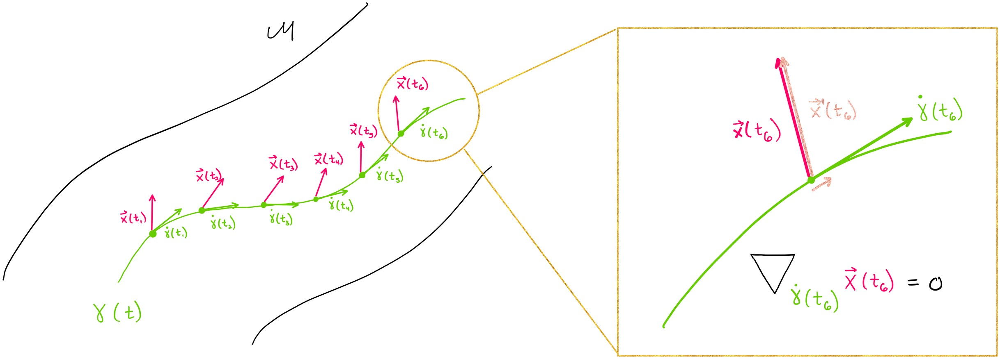

.. _first_steps:

==========================
Introduction to Geomstats
==========================

.. image:: ../geomstats_logo.jpg
  :width: 160
  :alt: Geomstats Logo

Data from many application fields are elements of manifolds. For instance,
the manifold of 3D rotations SO(3) naturally appears when performing statistical learning on 
articulated objects like the human spine or robotics arms. Likewise, shape spaces modeling biological shapes or other natural shapes 
are manifolds. Additional examples are introduced in Geomstats `paper <https://arxiv.org/abs/2004.04667>`_. Geomstats' `source code <https://github.com/geomstats/geomstats>`_ is freely available on GitHub.

.. figure:: ../geomstats_examples.jpg
   :alt: natural shapes
   :target: https://geomstats.github.io/notebooks/11_real_world_applications__cell_shapes_analysis.html
   :class: with-shadow
   :width: 1000px

   **Figure**: Shapes in natural sciences can be represented as data points on "manifolds". Images credits: Self Reflected, `Greg Dunn Neuro Art <www.gregadunn.com>`_, British Art Foundation, Ashok Prasad, Matematik Dunyasi, Gabriel Pérez.

Computations and statistics on manifolds require special tools of
`differential geometry <https://en.wikipedia.org/wiki/Differential_geometry>`_. Computing
the mean of two rotation matrices :math:`R_1, R_2` as :math:`\frac{R_1 + R_2}{2}` does not
generally give a rotation matrix. Statistics for data on manifolds need to be extended to
"geometric statistics" to perform consistent operations.

Objectives
----------

Geomstats is here to fulfill four objectives:

1. provide educational support to learn "hands-on" differential geometry and geometric statistics, through its examples and visualizations.
2. foster research in differential geometry and geometric statistics by providing operations on manifolds to gain intuition on results of a research paper;
3. democratize the use of geometric statistics by implementing user-friendly geometric learning algorithms using Scikit-Learn API; and
4. provide a platform to share learning algorithms on manifolds.

Design
------

Geomstats is organized into two main modules: `geometry` and `learning`.

The module `geometry <https://github.com/geomstats/geomstats/tree/master/geomstats/geometry>`_ implements concepts from differential geometry,
such as manifolds and Riemannian metrics. The module `learning <https://github.com/geomstats/geomstats/tree/master/geomstats/learning>`_ implements statistics and learning algorithms for data
on manifolds, such as supervised and unsupervised learning techniques.

   **Figure**: Parallel transport of a vector X (pink) along a geodesic (green) on the manifold M, e.g. representing a deformation's force acting on the time evolution of an organ shape. Image credits: `Adele Myers <https://ahma2017.wixsite.com/adelemyers>`_.

The code is object-oriented and follows Scikit-Learn's API. The operations are vectorized for batch computation and provide
support for different execution backends --- namely NumPy, PyTorch, Autograd and TensorFlow.

Installation
=============

The purpose of this guide is to illustrate the possible uses of geomstats.

**INSTALL GEOMSTATS WITH PIP3**

From a terminal (OS X & Linux), you can install geomstats and its requirements with ``pip3`` as follows::

    pip3 install geomstats

This method installs the latest version of geomstats that is uploaded on PyPi.

**INSTALL GEOMSTATS FROM GITHUB**

From a terminal (OS X & Linux), you can install geomstats and its requirements via Git as follows::

    git clone https://github.com/geomstats/geomstats.git
    cd geomstats
    pip3 install .

This methods installs the `latest GitHub version <https://github.com/geomstats/geomstats>`_. Developers should install this version, together with the development requirements and the optional requirements to enable ``tensorflow`` and ``pytorch`` backends::

    pip3 install .[dev,opt]

If you use the flag ``-e``, geomstats will be installed in editable mode, i.e. local changes are immediately reflected in your installation.

CHOOSE THE BACKEND
====================

Geomstats can run seemlessly with ``numpy``, ``tensorflow`` or ``pytorch``. Note that ``pytorch`` and ``tensorflow`` requirements are optional, as geomstats can be used with ``numpy`` only. By default, the ``numpy`` backend is used. The visualizations are only available with this backend.

To get the ``autograd``, ``tensorflow`` and ``pytorch`` versions compatible with geomstats, install the optional requirements::

    pip3 install geomstats[opt]

To install only the requirements for a given backend do::

    pip3 install geomstats[<backend_name>]

You can choose your backend by setting the environment variable ``GEOMSTATS_BACKEND`` to ``numpy``, ``autograd``, ``tensorflow`` or ``pytorch``, and importing the ``backend`` module. From the command line:

.. code-block:: bash

    export GEOMSTATS_BACKEND=<backend_name>

and in the Python3 code:

.. code-block:: python

    import geomstats.backend as gs

FIRST EXAMPLES
====================

To use `geomstats` for learning
algorithms on Riemannian manifolds, you need to follow three steps:
- instantiate the manifold of interest,
- instantiate the learning algorithm of interest,
- run the algorithm.
The data should be represented by the structure ``gs.array``, which represents numpy arrays, tensorflow or pytorch tensors, depending on the choice of backend.

As an example, the following code snippet illustrates the use of K-means
on simulated data on the 5-dimensional hypersphere.

.. code-block:: python

    from geomstats.geometry.hypersphere import Hypersphere
    from geomstats.learning.online_kmeans import OnlineKMeans

    sphere = Hypersphere(dim=5)

    data = sphere.random_uniform(n_samples=10)

    clustering = OnlineKMeans(metric=sphere.metric, n_clusters=4)
    clustering = clustering.fit(data)

The following code snippet shows the use of tangent Principal Component Analysis on simulated data on the
space of 3D rotations.

.. code-block:: python

    from geomstats.geometry.special_orthogonal import SpecialOrthogonal
    from geomstats.learning.pca import TangentPCA

    so3 = SpecialOrthogonal(n=3, point_type="vector")
    metric = so3.bi_invariant_metric

    data = so3.random_uniform(n_samples=10)

    tpca = TangentPCA(metric=metric, n_components=2)
    tpca = tpca.fit(data)
    tangent_projected_data = tpca.transform(data)

All geometric computations are performed behind the scenes.
The user only needs a high-level understanding of Riemannian geometry.
Each algorithm can be used with any of the manifolds and metric
implemented in the package.

To see additional examples, visit the page :ref:`examples`.
