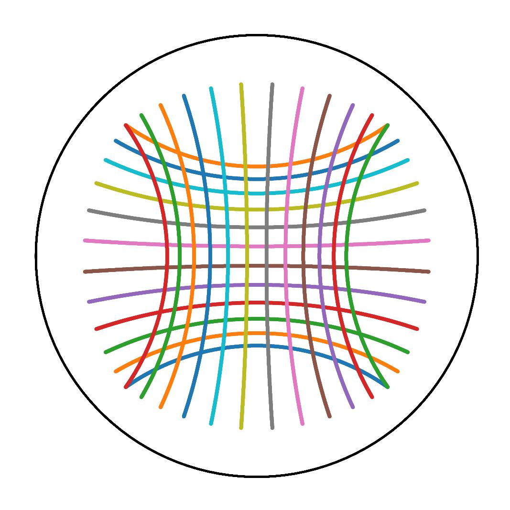
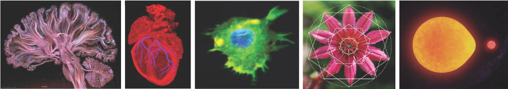
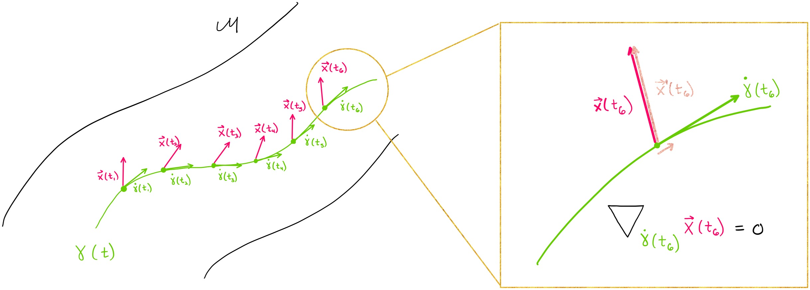

Geomstats
=========

**Geomstats** is an open-source Python package for computations, statistics, and machine learning on
nonlinear manifolds. Data from many application fields are elements of manifolds. For instance,
the manifold of 3D rotations SO(3) naturally appears when performing statistical learning on 
articulated objects like the human spine or robotics arms. Likewise, shape spaces modeling biological shapes or other natural shapes 
are manifolds. Additional examples are introduced in Geomstats `paper <https://arxiv.org/abs/2004.04667>`_. Geomstats' `source code <https://github.com/geomstats/geomstats>`_ is freely available on GitHub.

   **Figure**: Shapes in natural sciences can be represented as data points on "manifolds". Images credits: Greg Dunn Neuro Art, British Art Foundation, Ashok Prasad, Matematik Dunyasi, Gabriel Pérez.

Computations and statistics on manifolds require special tools of
`differential geometry <https://en.wikipedia.org/wiki/Differential_geometry>`_. Computing
the mean of two rotation matrices :math:`R_1, R_2` as :math:`\frac{R_1 + R_2}{2}` does not
generally give a rotation matrix. Statistics for data on manifolds need to be extended to
"geometric statistics" to perform consistent operations.

Objectives
----------

Geomstats is here to fulfill four objectives:

1. provide educational support to learn "hands-on" differential geometry and geometric statistics, through its examples and visualizations.
2. foster research in differential geometry and geometric statistics by providing operations on manifolds to gain intuition on results of a research paper;
3. democratize the use of geometric statistics by implementing user-friendly geometric learning algorithms using Scikit-Learn API; and
4. provide a platform to share learning algorithms on manifolds.

Design
------

Geomstats is organized into two main modules: `geometry` and `learning`.

The module `geometry <https://github.com/geomstats/geomstats/tree/master/geomstats/geometry>`_ implements concepts from differential geometry,
such as manifolds and Riemannian metrics. The module `learning <https://github.com/geomstats/geomstats/tree/master/geomstats/learning>`_ implements statistics and learning algorithms for data
on manifolds, such as supervised and unsupervised learning techniques.

   **Figure**: Parallel transport of a vector X (pink) along a geodesic (green) on the manifold M, e.g. representing a deformation's force acting on the time evolution of an organ shape. Image credits: `Adele Myers <https://ahma2017.wixsite.com/adelemyers>`_.

The code is object-oriented and follows Scikit-Learn's API. The operations are vectorized for batch computation and provide
support for different execution backends --- namely NumPy, PyTorch, Autograd and TensorFlow.

Learn More
----------

To learn how to use `geomstats`, visit :ref:`first_steps`. To contribute to `geomstats` visit :ref:`contributing`. To learn more about differential geometry and manifolds, visit :ref:`explanation`. To find more advanced examples, visit :ref:`tutorials`.

.. toctree::
   :maxdepth: 1
   :hidden:

   getting_started/index
   explanation/index
   tutorials/index
   contributing/index
   api/index
   Roadmap <roadmap>
   Governance <governance>
   Google Season of Docs <gsod>
   Hackathons <hackathons>

